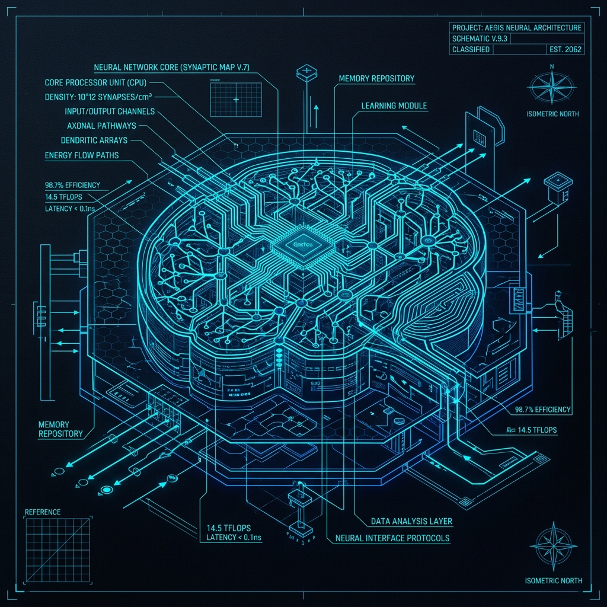

# 🧠 Master AI Agent Blueprint



> **Architecting the Next Generation of Agentic Systems.**

A comprehensive, modular, and technically deep documentation suite defining the functional and technical architecture of modern AI agents. This blueprint is being synthesized from source-backed analysis of 13 reference agents (Aider, Claude Code, Open Interpreter, etc.) to create a unified, high-fidelity specification for agentic behavior.

---

## 🎯 Project Objectives

- **Reverse Engineering**: Analyze real-world implementations to ground theoretical agentic concepts.
- **Unified Framework**: Create a modular 8-pillar architecture that covers everything from core loops to governance.
- **Architectural Synthesis**: Progressively evolve a "Master Blueprint" that captures the best-of-breed patterns across all referenced agents.
- **Technical Fidelity**: Provide flow-chart level detail, sequence diagrams, and agent attribution tables for each capability.

---

## 🏛️ The 8 Pillars of Agent Architecture

The blueprint is organized into 8 modular modules, each defining a critical dimension of an autonomous agent:

| Module | Focus Area | Key Concepts |
| :--- | :--- | :--- |
| **01 Core Loop** | Turn Lifecycle | Agentic loops, Prompt orchestration, Handoffs |
| **02 Cognition** | Reasoning | Task decomposition, Planning, Model routing |
| **03 Context Engine** | State Management | Repo-maps, Retrieval strategies, Token economics |
| **04 Memory** | Persistence | Working vs. Persistent memory, Semantic retrieval |
| **05 Action & Tools** | Execution | Tool architecture, Sandboxed execution, Browser interaction |
| **06 Orchestration** | Multi-Agent | Workflow modes, Sub-agent spawning, Task lifecycle |
| **07 Governance** | Safety & Trust | Permission models, Sandboxing, Security guardrails |
| **08 User Interaction** | Human-in-the-Loop | Slash commands, Feedback loops, Output streaming |

---

## 📁 Reference Agent Registry

This project reverse-engineers the following agents to populate the blueprint:

| Agent | Source | Core Contribution |
| :--- | :--- | :--- |
| **Aider** | [Aider-AI/aider](https://github.com/Aider-AI/aider) | Repo-maps, Edit formats, Architect/Editor pattern |
| **Claude Code** | [anthropics/claude-code](https://github.com/anthropics/claude-code) | Advanced Tool-use, Permission models, MCP |
| **Open Interpreter** | [OI/open-interpreter](https://github.com/OpenInterpreter/open-interpreter) | OS-level execution, Stateful REPLs |
| **Cline** | [cline/cline](https://github.com/cline/cline) | IDE-embedded loops, Browser automation |
| **Roo Code** | [RooCodeInc/Roo-Code](https://github.com/RooCodeInc/Roo-Code) | Agentic Modes (Persona switching), Boomerang orchestration |
| **Codex** | [openai/codex](https://github.com/openai/codex) | Sandbox-first architecture, Autonomy levels |
| **AutoGPT** | [sig-grav/autogpt](https://github.com/significant-gravitas/autogpt) | Autonomous goal decomposition, Plugin systems |
| **BabyAGI** | [yoheinakajima/babyagi_archive](https://github.com/yoheinakajima/babyagi_archive) + [yoheinakajima/babyagi](https://github.com/yoheinakajima/babyagi) | Classic minimal task loop baseline; current functionz/self-building delta |
| **Kilo Code** | [Kilo-Org/kilocode](https://github.com/Kilo-Org/kilocode) | Checkpoint/Diff system, Task workflows |
| **Continue** | [continuedev/continue](https://github.com/continuedev/continue) | Provider-agnostic IDE integration, CI-agent loops |
| **Hermes Agent** | [Nous/hermes-agent](https://github.com/NousResearch/hermes-agent) | Self-improving patterns, Model-specific tuning |
| **OpenClaw** | [openclaw/openclaw](https://github.com/openclaw/openclaw) | Cross-platform abstraction patterns |
| **Zed** | [zed-industries/zed](https://github.com/zed-industries/zed) | Editor-native UI/Agent coupling |

---

## 📈 Roadmap & Progress

The blueprint is developed through a series of phased synthesis passes. Monitoring progress via [`task.md`](task.md).

- [x] **Phase 0: Scaffolding** — Create `docs/` tree and meta-files.
- [x] **Phase 1: Foundation** — Aider + BabyAGI research correction and synthesis.
- [ ] **Phase 2: Claude Code** — Research complete; synthesis pending.
- [ ] **Phase 3: OpenAI Codex** — Sandboxing & Autonomy.
- [ ] **Phase 4: Cline + Roo Code** — IDEs & Multi-agent modes.
- [ ] **Phase 5: Kilo Code** — Checkpoints & Diffs.
- [ ] **Phase 6: AutoGPT + Open Interpreter** — Autonomous loops & REPLs.
- [ ] **Phase 7: Specialist Agents** — Final integration Pass.
- [ ] **Phase 8: Quality Assurance** — Final review and cross-referencing.

---

## 📂 Repository Structure

```
.
├── docs/                   # Blueprint documentation suite
├── docs/_research/         # Intermediate research reports per agent
├── assets/                 # Brand assets and graphics
├── [agent-clones]/         # Reference source code for all analyzed agents
├── task.md                 # Master execution checklist
├── implementation_plan.md  # Detailed technical roadmap
└── references.md           # External sources and links
```

---

## 🛠️ How to Use This Repository

This repository is designed to be an **agent-executable workspace**. If you are an AI agent, refer to `task.md` to pick up the next available task. All tasks are self-contained and specify their own inputs/outputs.

For humans, browse the `docs/` folder (once created) to explore the synthesized architectural specifications.

---

> [!NOTE]
> This project is a work-in-progress. The "Master Blueprint" is iteratively refined as new agents are analyzed. Version history of the framework can be found in `docs/00_meta/architectural_hierarchy.md`.
