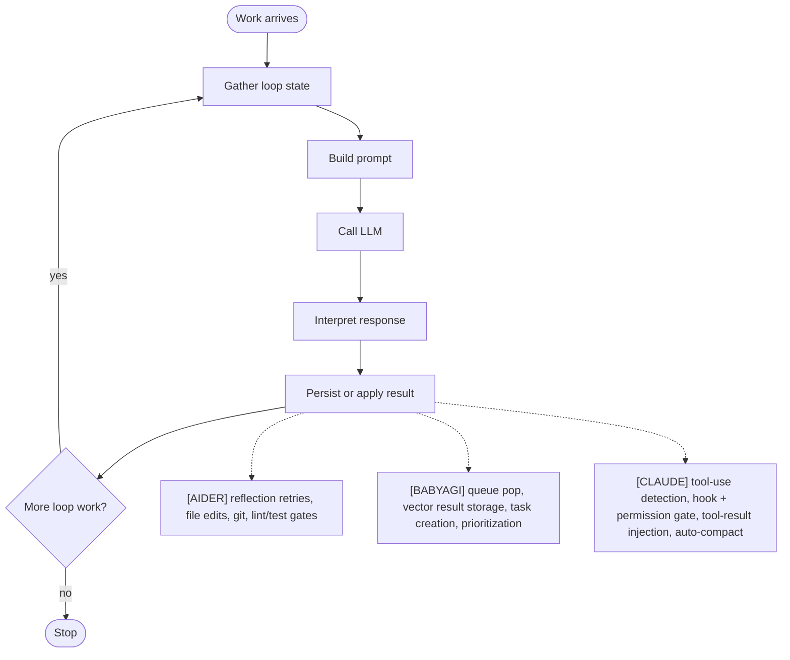
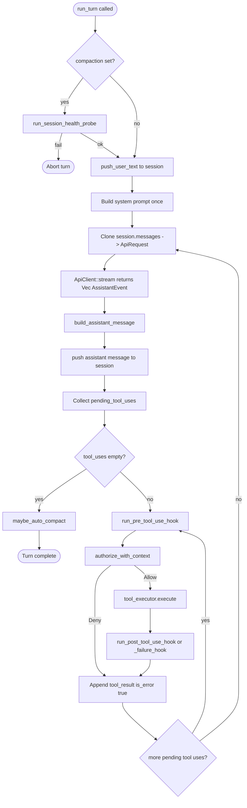
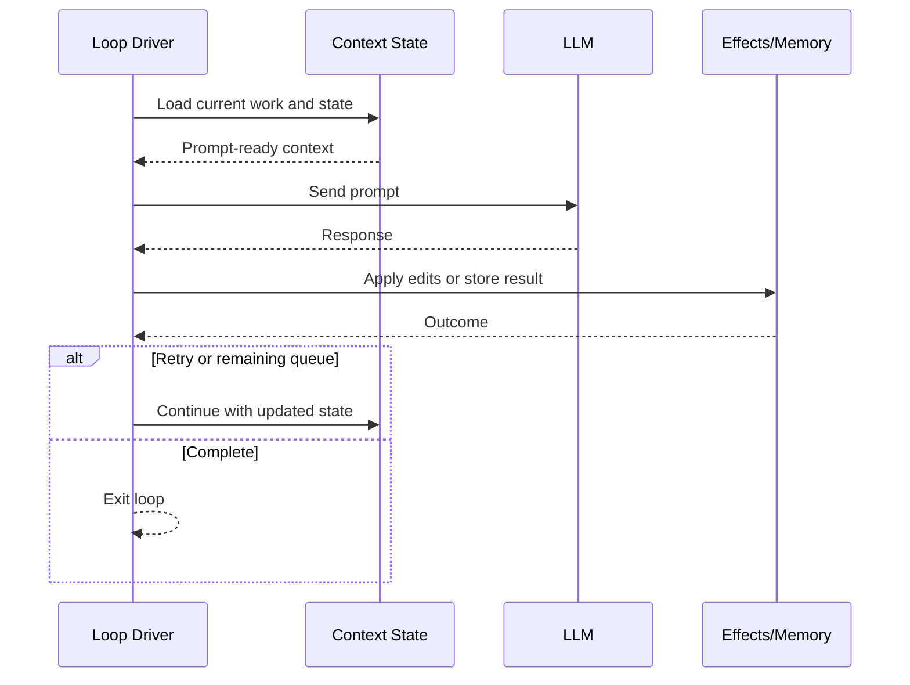
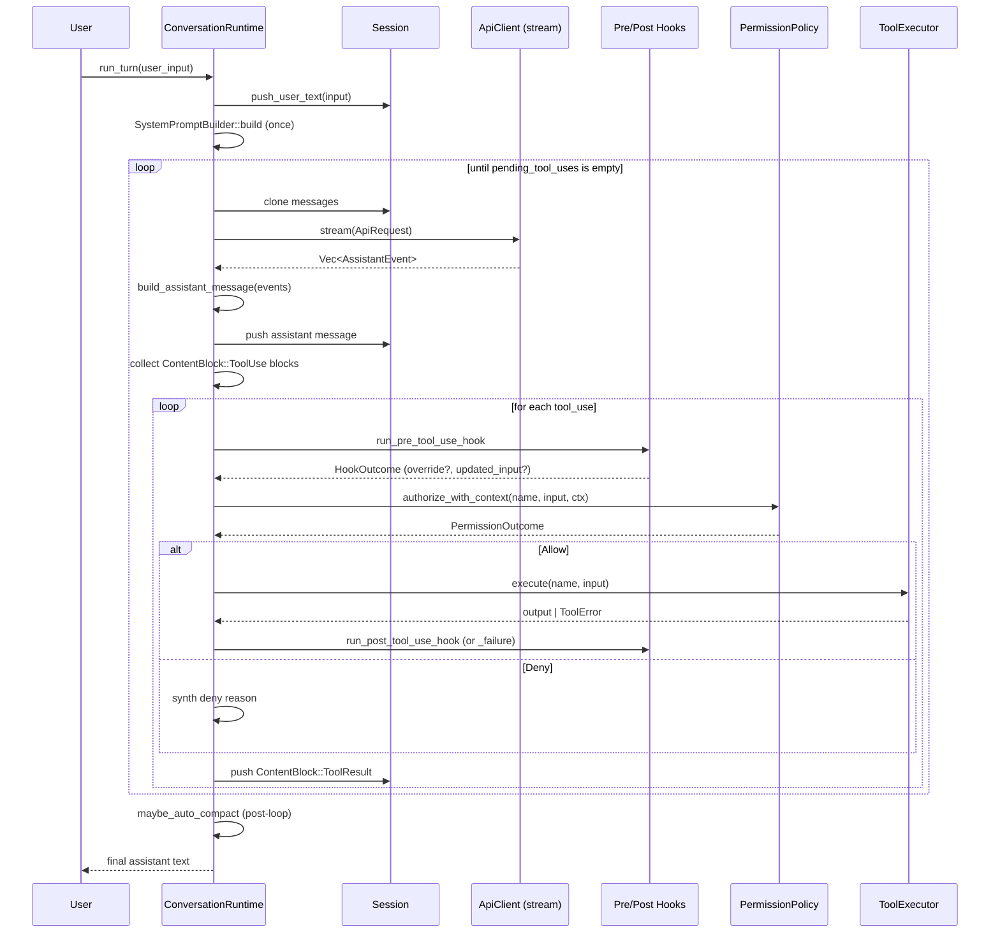

# Agentic Loop
> Module: 01_core_loop | Status: Phase 2 | Last Agent: Claude Code Synthesis

## 1. Overview
An agentic loop is the repeatable control structure that accepts work, gathers context, invokes a model, applies or records the result, and decides whether another pass is needed.

[AIDER] uses an interactive code-edit loop: user input is preprocessed, prompt chunks are assembled, the model response is parsed into edits or tool-like shell suggestions, file updates are applied, optional git commits are made, and failures can be reflected into another model pass.

[BABYAGI] uses a minimal objective-driven task loop: pop one task from an in-memory queue, execute it with an LLM prompt, store the result in vector memory, create new tasks, reprioritize the queue, and repeat until the queue is empty.

[CLAUDE] uses a tool-use loop driven by a single canonical entry point — `ConversationRuntime::run_turn(user_input, prompter)` (claw-code: `rust/crates/runtime/src/conversation.rs:314`). One user turn enters the loop, and the loop iterates `(LLM call → tool-use detection → permission gate → tool execution → tool-result injection)` until the assistant produces a response with **zero** `ToolUse` content blocks. That zero-tool-use response is the **termination condition** (`conversation.rs:396-398`). The loop is bounded by `max_iterations` (default `usize::MAX`) and followed by an optional auto-compaction pass (`conversation.rs:181, 502, 690-704`).

## 2. Blueprint Specification
Core loop contract:

| Element | Specification |
| --- | --- |
| Goal input | A user message, objective, or task description. |
| Working state | Conversation/files/validation state [AIDER]; task deque plus completed-result memory [BABYAGI]; `Session::messages` plus `TokenUsage` plus optional `Session::compaction` marker [CLAUDE]. |
| Context assembly | Ordered prompt chunks with files, repo map, history, reminders [AIDER]; objective, current task, and top recalled completed task names [BABYAGI]; system prompt built once outside the loop, then `ApiRequest { system_prompt, messages: session.messages.clone() }` re-cloned every iteration [CLAUDE]. |
| Model call | Routed through model settings and edit format [AIDER]; centralized `openai_call()` helper for prompt functions [BABYAGI]; `ApiClient::stream(request) -> Vec<AssistantEvent>` reduced into one assistant message per iteration [CLAUDE]. |
| Result handling | Parse edits, apply updates, commit, lint/test, reflect on failures [AIDER]; save execution result, create tasks, reprioritize tasks [BABYAGI]; for every `ContentBlock::ToolUse` block, run pre-hook → permission gate → tool executor → post-hook → append `ContentBlock::ToolResult` to the session [CLAUDE]. |
| Loop continuation | Reflected messages trigger up to three additional passes [AIDER]; remaining queued tasks trigger the next iteration [BABYAGI]; non-empty `pending_tool_uses` triggers another iteration; an empty list breaks the loop [CLAUDE]. |
| Post-loop | None [AIDER]; queue exhausted [BABYAGI]; `maybe_auto_compact()` may rewrite the session if cumulative `input_tokens >= CLAUDE_CODE_AUTO_COMPACT_INPUT_TOKENS` (default `100_000`) [CLAUDE]. |

## 3. Logic Flow
1. Accept the next unit of work.
2. Normalize input and gather context.
3. Invoke the model with the current prompt contract.
4. Convert the model response into state changes.
5. Run any validation, persistence, or memory updates.
6. Decide whether to stop, continue, or reflect errors into another pass.

[AIDER] treats malformed edits, file discovery, lint failures, and test failures as possible `reflected_message` inputs, with confirmation gates for lint and test repair.

[BABYAGI] treats task execution as text production, then lets task creation and prioritization prompts mutate the future queue.

[CLAUDE] treats every assistant response as either "final text" or "more tool-use." The detailed per-iteration sequence is:
1. **Pre-turn health probe**: if `session.compaction.is_some()`, run `run_session_health_probe`; abort the turn on probe failure (`conversation.rs:295-326`).
2. **Append user input** to the session as a `ContentBlock::Text` block via `Session::push_user_text` (`conversation.rs:333`).
3. **Build system prompt once** outside the loop via `SystemPromptBuilder::build` (`prompt.rs:144-166`).
4. **Iteration N starts**: clone `session.messages`, send `ApiRequest { system_prompt, messages }` to `ApiClient::stream` (`conversation.rs:352-362`).
5. **Reduce the event stream**: walk `Vec<AssistantEvent>` (`TextDelta`, `ToolUse`, `Usage`, `PromptCache`, `MessageStop`) into a single assistant message, then push it to the session (`conversation.rs:706-753`).
6. **Detect tool use**: filter the assistant blocks for `ContentBlock::ToolUse { id, name, input }` (`conversation.rs:375-384`). If empty → break (loop exit).
7. **For each pending tool use** (sequentially, not in parallel within the harness):
   a. `run_pre_tool_use_hook(tool_name, input)` (`conversation.rs:401-406`; see `audit_and_observability.md`).
   b. Build `PermissionContext` from the hook's `permission_override`/`permission_reason`.
   c. `permission_policy.authorize_with_context(name, effective_input, ctx, prompter)` returns `Allow | Deny | Prompt` (`permissions.rs:175-292`).
   d. On `Allow`, `tool_executor.execute(name, input)` runs the tool (`conversation.rs:445`).
   e. `run_post_tool_use_hook` or `run_post_tool_use_failure_hook` (`conversation.rs:457-483`).
   f. Append `ConversationMessage::tool_result(tool_use_id, tool_name, output, is_error)` to the session (`conversation.rs:494-496`; `session.rs:653-665`).
8. **Iteration N+1**: re-clone `session.messages` (now containing the tool results) and loop back to step 4.
9. **Post-loop**: `maybe_auto_compact()` runs and may emit `AutoCompactionEvent { removed_message_count }` (`conversation.rs:690-704`).

## 4. Flowchart

[CLAUDE] pattern, expanded:

## 5. Sequence Diagram

[CLAUDE] tool-use loop:

## 6. Variations & Trade-offs
| Variation | Benefit | Trade-off |
| --- | --- | --- |
| Reflection loop [AIDER] | Repairs parse and validation failures inside the same conversation. | Needs retry caps and user gates to avoid uncontrolled follow-up work. |
| Queue loop [BABYAGI] | Simple autonomous progression from objective to next task. | Pending tasks are in memory and natural-language parsing is brittle. |
| Full-file/edit-protocol loop [AIDER] | Enables direct code modification with scoped files. | Requires parser-specific prompts and failure handling. |
| Text-result loop [BABYAGI] | Minimal implementation and easy to inspect. | No first-class tools, verification, or edit application. |
| Tool-use protocol loop [CLAUDE] | Structured `ToolUse`/`ToolResult` blocks make the loop boundary self-evident — the LLM decides termination by emitting text-only. | Sequential tool dispatch in the harness (no in-iteration parallelism); model can stall in long tool-use chains; needs hook + permission machinery to be safe. |
| Iteration cap [CLAUDE] | `with_max_iterations` lets callers bound runaway tool chains (`conversation.rs:192`). | Default of `usize::MAX` (`conversation.rs:181`) means callers must opt-in to a cap; runaway is theoretically possible. |
| Post-turn auto-compaction [CLAUDE] | The loop never compacts mid-turn — only after termination — so tool-result correlation is preserved. | A single turn that crosses the threshold cannot be rescued mid-flight; the next turn carries the compaction marker and must pass the health probe. |

## 7. Agent Attribution Table
| Agent | Source-backed contribution |
| --- | --- |
| [AIDER] | Interactive coding loop with input preprocessing, context chunks, model call, edit parsing, file application, git checkpoints, and optional lint/test reflection. |
| [BABYAGI] | Objective loop with task deque, execution prompt, vector result storage, task creation prompt, prioritization prompt, and queue replacement. |
| [CLAUDE] | `ConversationRuntime::run_turn` tool-use protocol loop with health probe, single system-prompt assembly, per-iteration message-cloning, `Vec<AssistantEvent>` reduction, hook + permission gating, file-based tool-result injection, configurable iteration cap, and post-turn auto-compaction. |
