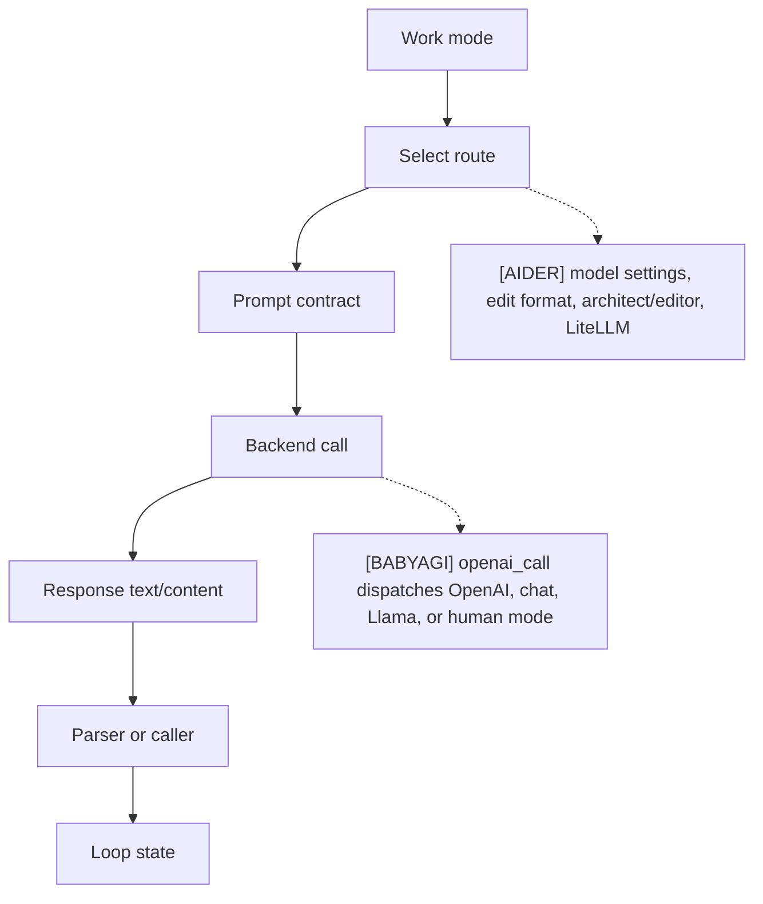
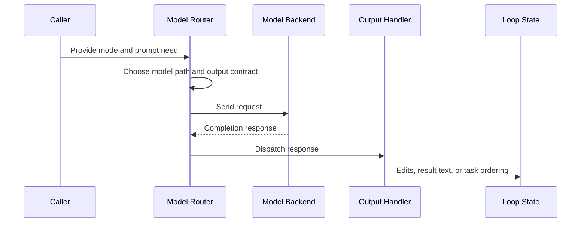

# Model Routing
> Module: 02_cognition | Status: Phase 1 | Last Agent: Worker C

## 1. Overview
Model routing chooses which model path, prompt contract, and response parser should handle a given step.

[AIDER] has explicit routing through model settings, edit formats, chat modes, architect/editor model selection, weak/main models for summarization, and `Model.send_completion()` via LiteLLM.

[BABYAGI] has minimal routing: all three archive prompt agents call `openai_call()`, which dispatches between local Llama mode, human mode, non-chat OpenAI completions, and `gpt-*` chat completions.

## 2. Blueprint Specification
| Element | Specification |
| --- | --- |
| Route selector | CLI/model settings, chat mode, edit format, editor model fields [AIDER]; model name and mode flags inside `openai_call()` [BABYAGI]. |
| Prompt coupling | Route selects coder prompts and parser behavior [AIDER]; route reuses plain prompt strings for each agent function [BABYAGI]. |
| Execution backend | LiteLLM completion request with model name, stream flag, temperature, tool/function call options, and extra params [AIDER]; OpenAI Completion, ChatCompletion, local Llama, or human input branch [BABYAGI]. |
| Specialized route | Architect model can delegate to editor model with editor edit format [AIDER]; no separate planner/executor model split in the archive baseline [BABYAGI]. |
| Response handling | Content or function-call accumulation before edit parsing [AIDER]; text response returned to task loop or list parser [BABYAGI]. |

## 3. Logic Flow
1. Identify the work mode.
2. Select model and prompt contract.
3. Build the backend request.
4. Send the request.
5. Route the response to the matching parser or caller.
6. Feed parsed output back into loop state.

[AIDER] treats edit format as a routing contract because changing it swaps both prompt examples and parser implementation.

[BABYAGI] routes by model family rather than task type; execution, task creation, and prioritization share the same call helper.

## 4. Flowchart

## 5. Sequence Diagram

## 6. Variations & Trade-offs
| Variation | Benefit | Trade-off |
| --- | --- | --- |
| Edit-format routing [AIDER] | Keeps prompts aligned with parsers. | More route combinations to test. |
| Architect/editor routing [AIDER] | Lets planning and editing use different model/configuration choices. | Handoff adds latency and state-copying complexity. |
| Central helper routing [BABYAGI] | Keeps model invocation easy to inspect. | No task-specific model policy beyond prompt differences. |
| Human or local mode [BABYAGI] | Provides simple alternate execution branches. | The archive loop still lacks robust tool, permission, or validation routing. |

## 7. Agent Attribution Table
| Agent | Source-backed contribution |
| --- | --- |
| [AIDER] | Model settings, registered edit formats, LiteLLM request construction, prompt/parser coupling, architect/editor model routing, and weak/main summarization paths. |
| [BABYAGI] | Shared `openai_call()` dispatch across local Llama, human mode, OpenAI Completion, and `gpt-*` ChatCompletion for execution, creation, and prioritization prompts. |
