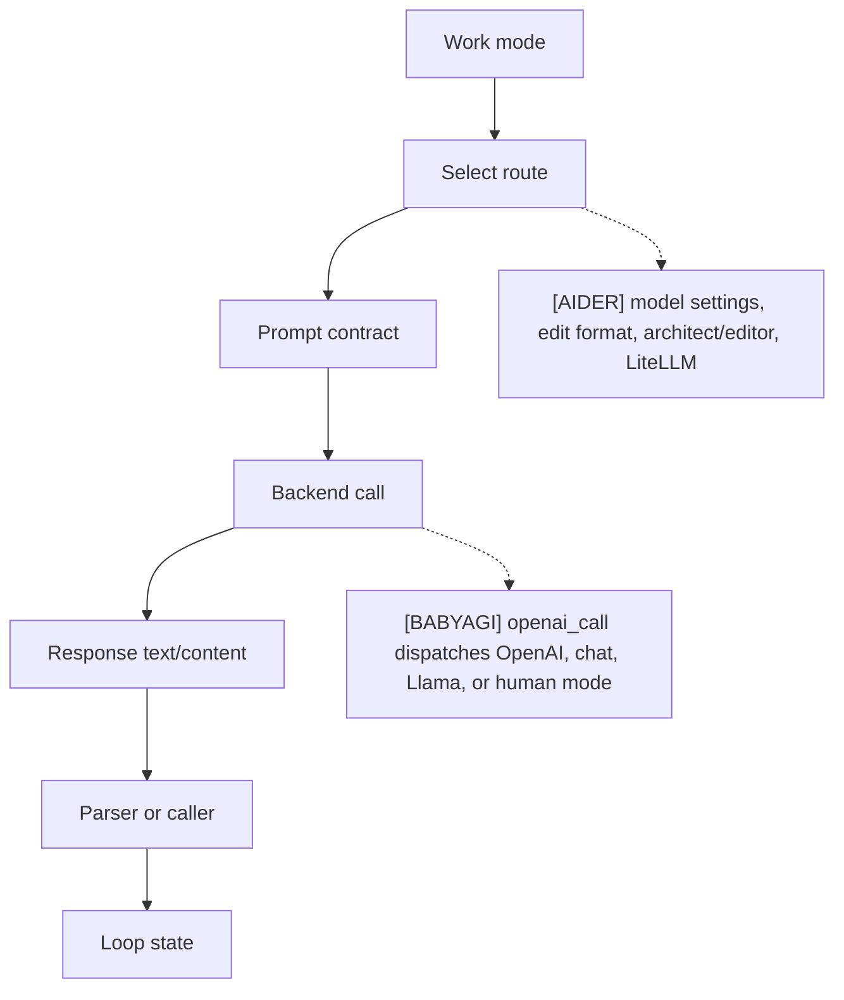
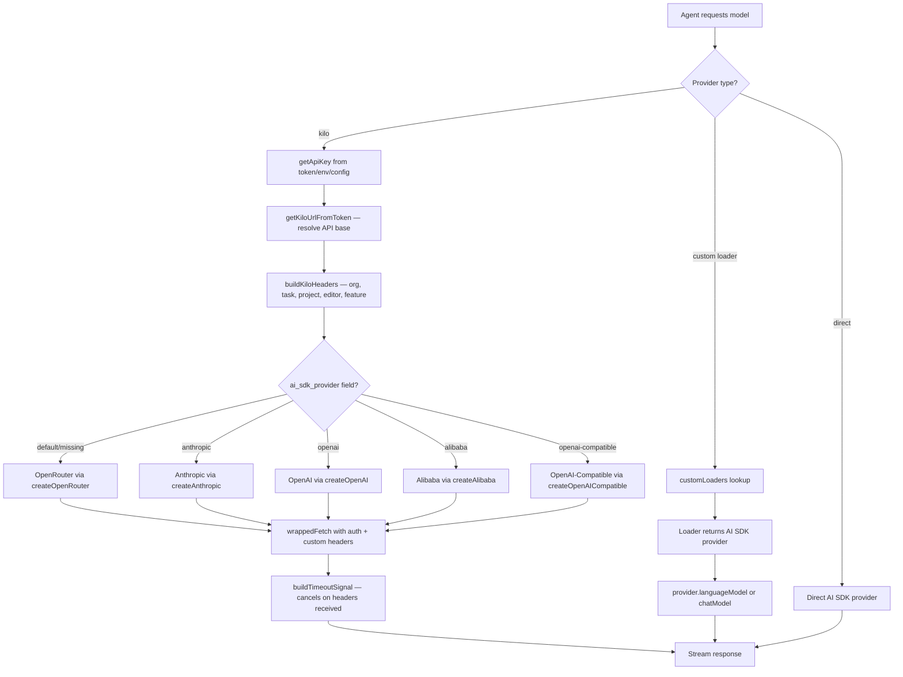
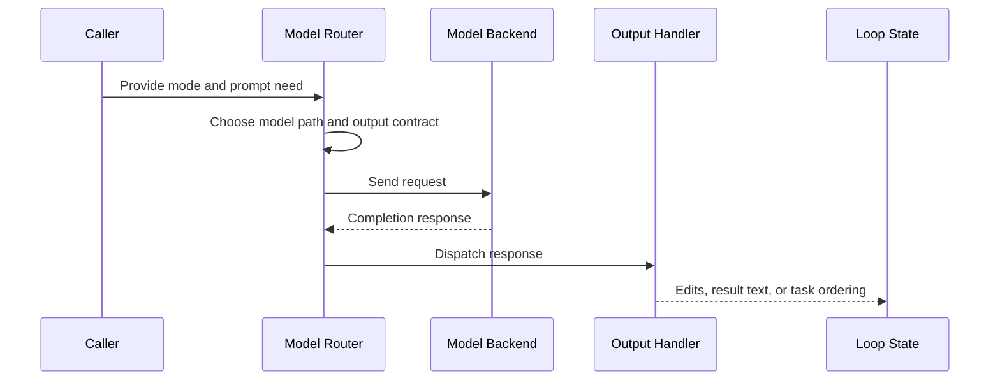

# Model Routing
> Module: 02_cognition | Status: Phase 5 | Last Agent: Kilo/OpenCode Synthesis

## 1. Overview
Model routing chooses which model path, prompt contract, and response parser should handle a given step.

[AIDER] has explicit routing through model settings, edit formats, chat modes, architect/editor model selection, weak/main models for summarization, and `Model.send_completion()` via LiteLLM.

[BABYAGI] has minimal routing: all three archive prompt agents call `openai_call()`, which dispatches between local Llama mode, human mode, non-chat OpenAI completions, and `gpt-*` chat completions.

[KILO] introduces a **proxy-first multi-provider architecture** via the Kilo Gateway (`@kilocode/kilo-gateway`). All model requests route through a unified OpenRouter-backed proxy that adds custom auth headers, organization scoping, and model metadata (recommended index, free tier, AI SDK provider hints). The gateway wraps five AI SDK providers — OpenRouter (default), Anthropic, OpenAI, Alibaba, and OpenAI-compatible — behind a single `createKilo()` factory. Provider-specific patches inject required headers (e.g., Anthropic's `claude-code-20250219` beta, Cerebras' 3rd-party integration header). A custom timeout handler (`buildTimeoutSignal`) replaces `AbortSignal.timeout()` with a cancellable timer that clears once response headers arrive.

[OPENCODE] provides the custom-loader foundation that Kilo extends. Each provider is loaded via `customLoaders` — async factory functions that return AI SDK-compatible provider instances. Providers auto-detect credentials from environment variables, auth stores, or config files. The `models.dev` registry supplies model metadata (context limits, capabilities, costs).

## 2. Blueprint Specification
| Element | Specification |
| --- | --- |
| Route selector | CLI/model settings, chat mode, edit format, editor model fields [AIDER]; model name and mode flags inside `openai_call()` [BABYAGI]. |
| Prompt coupling | Route selects coder prompts and parser behavior [AIDER]; route reuses plain prompt strings for each agent function [BABYAGI]. |
| Execution backend | LiteLLM completion request with model name, stream flag, temperature, tool/function call options, and extra params [AIDER]; OpenAI Completion, ChatCompletion, local Llama, or human input branch [BABYAGI]. |
| Specialized route | Architect model can delegate to editor model with editor edit format [AIDER]; no separate planner/executor model split in the archive baseline [BABYAGI]. |
| Response handling | Content or function-call accumulation before edit parsing [AIDER]; text response returned to task loop or list parser [BABYAGI]. |

## 3. Logic Flow
1. Identify the work mode.
2. Select model and prompt contract.
3. Build the backend request.
4. Send the request.
5. Route the response to the matching parser or caller.
6. Feed parsed output back into loop state.

[AIDER] treats edit format as a routing contract because changing it swaps both prompt examples and parser implementation.

[BABYAGI] routes by model family rather than task type; execution, task creation, and prioritization share the same call helper.

[KILO] routes by provider identity via the Kilo Gateway:
1. Determine auth state (token, env var, or anonymous).
2. Select the target URL from the token payload (custom vs default API base).
3. Build request headers (org ID, task ID, project ID, editor name, feature flag).
4. Route model to the appropriate sub-provider via `ai_sdk_provider` metadata field (`alibaba`, `anthropic`, `openai`, `openai-compatible`).
5. Apply provider-specific patches (beta headers, endpoint overrides).
6. Send via wrapped fetch with custom headers injected.

[OPENCODE] routes by custom loader name:
1. Provider name is looked up in `customLoaders` map.
2. Loader function returns an AI SDK provider instance.
3. Model ID is passed to `provider.languageModel(modelID)` or `provider.chatModel(modelID)`.
4. Result is an AI SDK `LanguageModel` ready for streaming.

## 4. Flowchart

### [KILO] Kilo Gateway Routing

## 5. Sequence Diagram

## 6. Variations & Trade-offs
| Variation | Benefit | Trade-off |
| --- | --- | --- |
| Edit-format routing [AIDER] | Keeps prompts aligned with parsers. | More route combinations to test. |
| Architect/editor routing [AIDER] | Lets planning and editing use different model/configuration choices. | Handoff adds latency and state-copying complexity. |
| Central helper routing [BABYAGI] | Keeps model invocation easy to inspect. | No task-specific model policy beyond prompt differences. |
| Human or local mode [BABYAGI] | Provides simple alternate execution branches. | The archive loop still lacks robust tool, permission, or validation routing. |
| Per-mode model routing [ROO] | Different LLMs per mode — Opus for planning, Sonnet for coding, cheap for Q&A. | Mode switches require API config reload; 500ms settling sleep. |
| **Proxy-first via Kilo Gateway** [KILO] | Single API surface wraps 5 AI SDK providers; custom auth, org scoping, and model metadata (free tier, recommended index, small model priority) enable unified billing and routing. Anonymous access with free models lowers the barrier to entry. | Proxy adds a network hop; locked to OpenRouter as the default backend; token-based URL resolution adds complexity. |
| **Provider-specific patches** [KILO] | Anthropic beta headers, Cerebras 3rd-party headers, Azure endpoint overrides, and OpenRouter default headers are applied transparently by `patchCustomLoaderResult`. | Provider-patch registry must be maintained as providers evolve; patches are applied at load time, not per-request. |
| **Custom timeout handling** [KILO] | `buildTimeoutSignal()` replaces `AbortSignal.timeout()` with a timer that clears once response headers arrive — prevents aborting healthy long-running streaming responses. | Custom abort controller management; must clear timeout on both success and failure paths. |
| **Custom loader extensibility** [OPENCODE] | Any provider can be added via an async factory function — no source changes needed for new providers. | Loader must return an AI SDK-compatible interface; loader errors surface at model-resolution time, not at config-parse time. |

## 7. Agent Attribution Table
| Agent | Source-backed contribution |
| --- | --- |
| [AIDER] | Model settings, registered edit formats, LiteLLM request construction, prompt/parser coupling, architect/editor model routing, and weak/main summarization paths. |
| [BABYAGI] | Shared `openai_call()` dispatch across local Llama, human mode, OpenAI Completion, and `gpt-*` ChatCompletion for execution, creation, and prioritization prompts. |
| [ROO] | Per-mode model routing via `ProviderSettingsManager.getModeConfigId(mode)` returning saved API config per mode (GPT-5 for code, Opus for architect, cheap for ask). |
| [KILO] | Kilo Gateway (`@kilocode/kilo-gateway`) proxy provider wrapping OpenRouter, Anthropic, OpenAI, Alibaba, and OpenAI-compatible backends behind `createKilo()` factory; `getApiKey()` credential resolution from options → env → auth store → anonymous fallback; `getKiloUrlFromToken()` token-derived API base URL; `buildKiloHeaders()` with organization ID, task ID, project ID, machine ID, editor name, and feature flag headers; `wrappedFetch` injecting auth + custom headers; `KILO_BUNDLED_PROVIDERS` mapping for provider registration; model schema extensions (`recommendedIndex`, `prompt`, `isFree`, `ai_sdk_provider`); `patchCustomLoaderResult()` injecting Anthropic beta header, OpenRouter/Vercel/Zenmux default headers, Cerebras 3rd-party header, Azure endpoint resolution; `buildTimeoutSignal()` cancellable timeout that clears on response headers; small model priority via `kilo-auto/small`; `kiloCustomLoader` async factory with credential auto-detection. |
| [OPENCODE] | Custom loader system (`customLoaders` map) with async factory functions returning AI SDK providers; `models.dev` registry for model metadata (context limits, capabilities, costs); provider auto-detection from environment variables. |

> Phase 6 [AUTOGPT] may add budget-aware routing.
