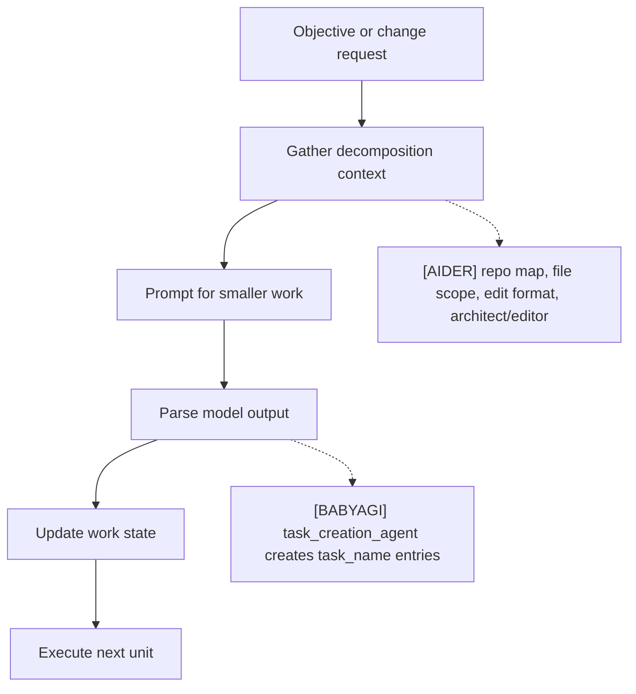
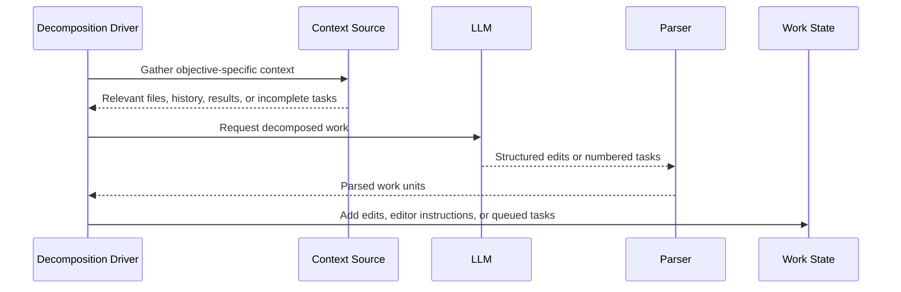

# Task Decomposition
> Module: 02_cognition | Status: Phase 1 | Last Agent: Worker C

## 1. Overview
Task decomposition converts a broad objective or user request into smaller work units that can be executed, validated, or reordered.

[AIDER] decomposes coding work mostly through file scope, edit formats, repo-map hints, and optional architect/editor delegation rather than through a persistent task queue.

[BABYAGI] decomposes work explicitly: `task_creation_agent()` uses the last execution result, the original objective, the completed task description, and incomplete task names to propose new tasks.

## 2. Blueprint Specification
| Element | Specification |
| --- | --- |
| Decomposition trigger | User asks for a coding change or architect plan [AIDER]; execution result completes for the current task [BABYAGI]. |
| Work unit | File edit block, whole-file update, patch, or editor instruction [AIDER]; `{"task_id": ..., "task_name": ...}` dictionary [BABYAGI]. |
| Context for split | File mentions, repo-map identifiers, chat history, editable files [AIDER]; objective, last result, last task, incomplete task names [BABYAGI]. |
| Output parser | Edit-format parser or architect-to-editor handoff [AIDER]; numbered-list parser with regex cleanup [BABYAGI]. |
| State update | Files changed and possibly committed [AIDER]; new task dictionaries appended to the deque [BABYAGI]. |

## 3. Logic Flow
1. Identify the current objective or requested change.
2. Gather context that constrains valid work units.
3. Ask the model for decomposed work in a format the runtime can consume.
4. Parse and sanitize the model output.
5. Update the executable work state.

[AIDER] architect mode separates planning from editing: the architect produces implementation instructions and a fresh editor coder applies them with a narrower edit prompt.

[BABYAGI] assigns authoritative task ids after parsing new task names, so model-provided numbering is only a response format.

## 4. Flowchart

## 5. Sequence Diagram

## 6. Variations & Trade-offs
| Variation | Benefit | Trade-off |
| --- | --- | --- |
| File-scope decomposition [AIDER] | Keeps coding work grounded in editable files. | Does not create a durable task graph. |
| Architect/editor split [AIDER] | Allows a planning model to delegate implementation. | Requires user acceptance unless auto-accept is enabled. |
| Result-driven task creation [BABYAGI] | Lets completed work generate the next plan. | New tasks depend on brittle natural-language list parsing. |
| In-memory queue [BABYAGI] | Minimal and easy to reason about. | No task history, retries, leases, or durable pending state. |

## 7. Agent Attribution Table
| Agent | Source-backed contribution |
| --- | --- |
| [AIDER] | Decomposition through scoped files, repo-map hints, edit-format contracts, and architect/editor delegation. |
| [BABYAGI] | Explicit task decomposition through `task_creation_agent()`, parsed `task_name` entries, authoritative id assignment, and deque append. |
