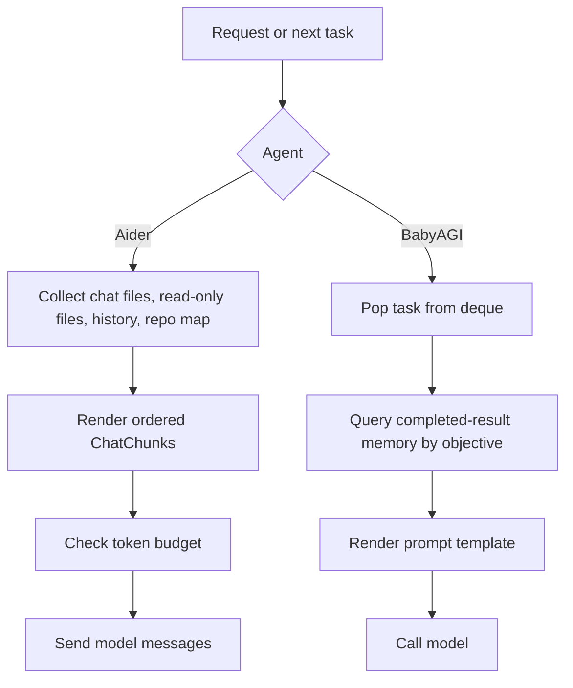
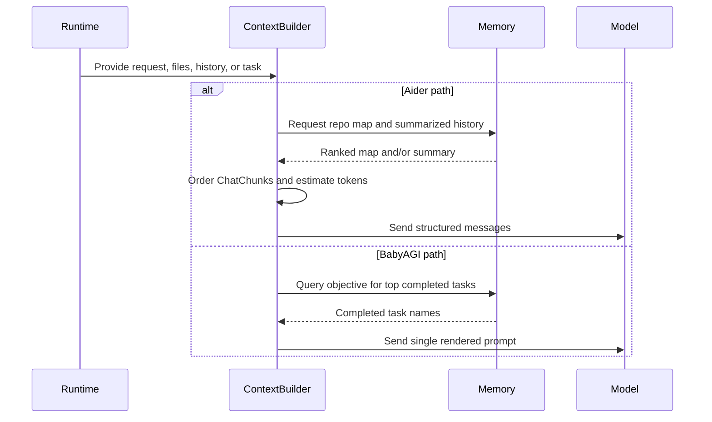

# Context Assembly
> Module: 03_context_engine | Status: Phase 1 Draft | Last Agent: Worker D

## 1. Overview

Context assembly is the step that turns task state, selected files, retrieved memory, and current user input into the prompt sent to the model. [AIDER] Aider treats this as a structured message build: system prompt, examples, read-only files, repo map, summarized history, editable files, current turn, and reminders are ordered before token checks. [BABYAGI] BabyAGI keeps context minimal: the objective, current task, and up to five semantically recalled completed task names are inserted into simple prompt templates.

## 2. Blueprint Specification

- Inputs: current user/task request, active file set or task queue state, memory/retrieval output, model limits, and agent-specific prompt rules. [AIDER][BABYAGI]
- Aider file context has two lanes: editable full-content files and read-only reference material such as repo maps or read-only files. [AIDER]
- Aider conversation history is split between active messages and completed messages that may be summarized and reinserted as a user message. [AIDER]
- BabyAGI execution context is queried from completed-result memory by objective and returns prior task names rather than full result bodies. [BABYAGI]
- Output: a model-ready message list or prompt string plus enough metadata to decide whether to proceed, shrink context, or ask for more files. [AIDER][BABYAGI]

## 3. Logic Flow

1. Collect the active request and state: Aider gathers chat files, read-only files, repo-map candidates, current messages, and reminders; BabyAGI pops the next task from the deque. [AIDER][BABYAGI]
2. Retrieve auxiliary context: Aider may produce a graph-ranked repo map, while BabyAGI queries vector memory with the objective for recent completed task names. [AIDER][BABYAGI]
3. Render prompt material using the agent's protocol: Aider formats fenced file content and coder-specific instructions; BabyAGI fills execution, creation, or prioritization prompt templates. [AIDER][BABYAGI]
4. Apply ordering and scope rules: Aider puts stable/reference context before current turn content and reminds the model that mapped files are read-only; BabyAGI includes only the current task plus concise memory context. [AIDER][BABYAGI]
5. Check size: Aider estimates tokens before sending and can prompt the user when context is too large; BabyAGI trims chat prompts for some OpenAI models and uses small max-token defaults. [AIDER][BABYAGI]

## 4. Flowchart

## 5. Sequence Diagram

## 6. Variations & Trade-offs

- Full-file context gives the model concrete edit authority but spends tokens quickly; Aider reserves that for explicitly added editable files. [AIDER]
- Repo-map context is cheaper and broader than full files, but it is read-only until the user adds files to chat. [AIDER]
- Semantic recall from completed results is very small and easy to reason about, but BabyAGI loses detailed result bodies in the execution prompt because recall returns task names. [BABYAGI]
- Summarized history preserves continuity under token pressure, but it depends on summary quality; BabyAGI avoids this complexity by keeping little working context. [AIDER][BABYAGI]

## 7. Agent Attribution Table
| Agent | Source-backed contribution |
|---|---|
| Aider | [AIDER] Structured `ChatChunks` ordering, editable vs read-only file context, repo-map insertion, history summarization, token checks, and file-scope reminders. |
| BabyAGI | [BABYAGI] Minimal objective/task prompt assembly, top-k vector recall of completed task names, and simple prompt templates for execution, task creation, and prioritization. |
