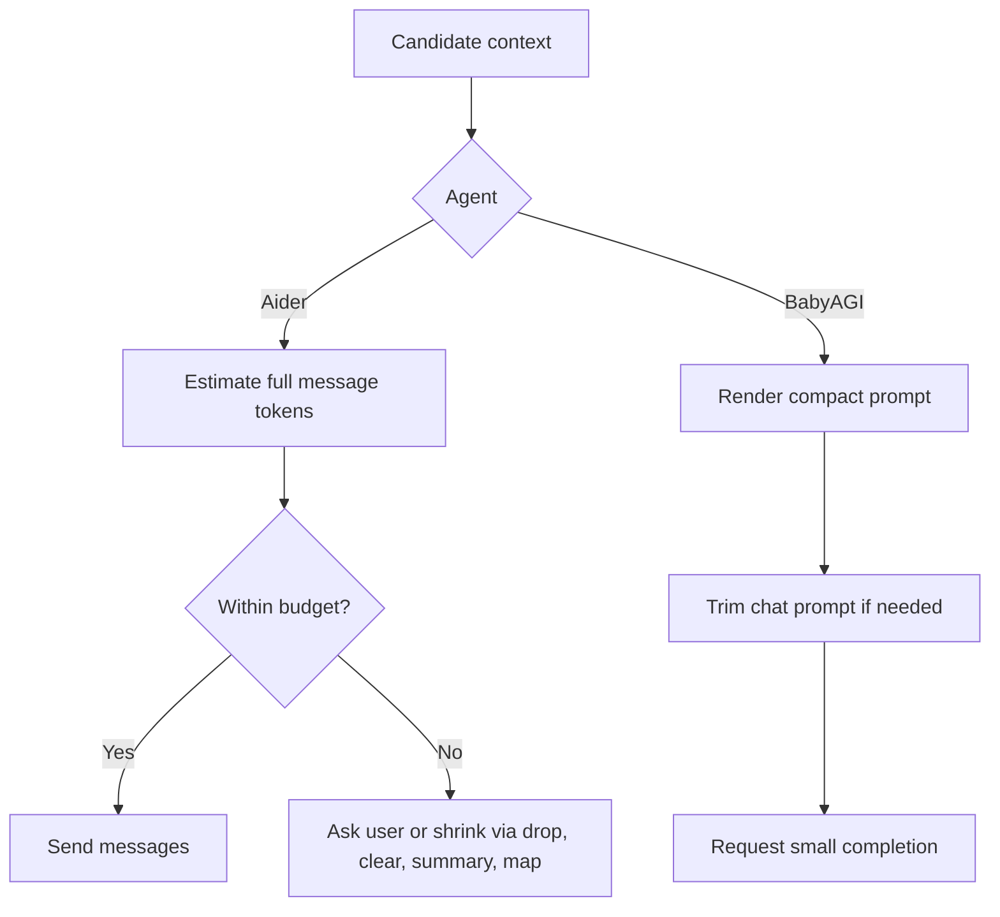
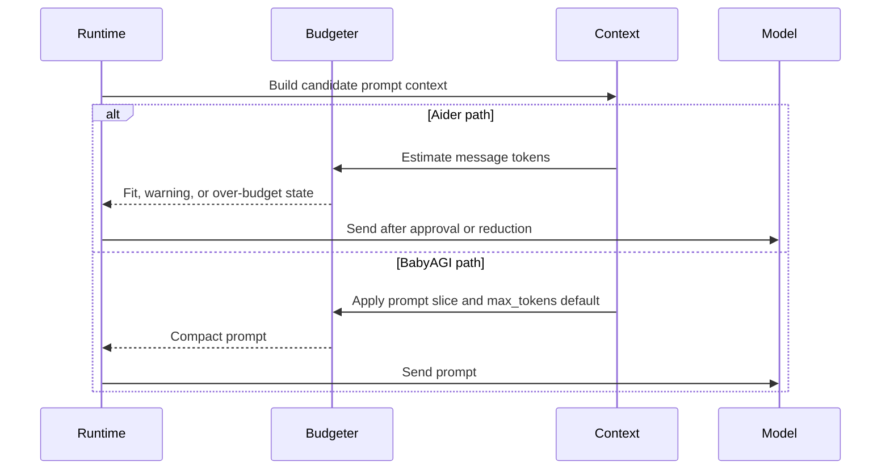

# Token Economics
> Module: 03_context_engine | Status: Phase 7 | Last Agent: Phase 7 Specialist Synthesis 

## 1. Overview

Token economics describes how each agent spends, reserves, and reduces context. [AIDER] Aider performs explicit token estimation over the assembled message list, budgets repo-map size from the model's input window, and exposes token pressure through commands and confirmation prompts. [BABYAGI] BabyAGI keeps prompts short by design, uses small default completion limits, and trims some chat prompts before dispatch.

## 2. Blueprint Specification

- Budget inputs: model input limit, generated-output allowance, current files/history, retrieval content, and agent prompt scaffolding. [AIDER][BABYAGI]
- Aider default repo-map budget is derived from the model input limit and clamped to a moderate range unless overridden. [AIDER]
- Aider estimates the full message list before sending and can ask whether to proceed when context exceeds the configured limit. [AIDER]
- BabyAGI's `openai_call()` uses `max_tokens=100` by default for many prompt calls and trims `gpt-*` prompts against a 4000-token working limit. [BABYAGI]
- Cost control is mostly structural in BabyAGI: memory returns only task names and prompts are single-template strings. [BABYAGI]

## 3. Logic Flow

1. Assemble candidate context from system instructions, examples, files, repo map, history, memory, and current task/request. [AIDER][BABYAGI]
2. Estimate or constrain size before invocation: Aider checks token count for all messages; BabyAGI slices long chat prompts before sending. [AIDER][BABYAGI]
3. Reduce broad context first: Aider can use repo maps and summaries instead of full files/history; BabyAGI limits recall to a small top-k set. [AIDER][BABYAGI]
4. Preserve high-authority context: Aider keeps editable files as full content when selected, while BabyAGI always includes objective and current task. [AIDER][BABYAGI]
5. Surface pressure: Aider can report token/cost breakdown and suggest dropping or clearing context; BabyAGI exposes little runtime budgeting feedback in the Phase 1 loop. [AIDER][BABYAGI]

## 4. Flowchart

## 5. Sequence Diagram

## 6. Variations & Trade-offs

- Explicit token accounting supports larger and safer coding sessions but adds control flow around warnings and user decisions. [AIDER]
- Repo maps and summaries preserve breadth under pressure but can hide details needed for exact edits. [AIDER]
- Tiny prompts keep BabyAGI cheap and understandable, but they provide little protection against poor prioritization or missing context. [BABYAGI]
- Returning only task names from memory sharply reduces token load while discarding result detail that could improve execution. [BABYAGI]

## 7. Agent Attribution Table
| Agent | Source-backed contribution |
|---|---|
| Aider | [AIDER] Full-message token checks, repo-map token budgeting, history summarization, prompt-cache chunking, and user-visible token/cost feedback. |
| BabyAGI | [BABYAGI] Compact prompt templates, small default generation limits, prompt slicing for chat models, and top-k task-name recall to minimize prompt size. |
