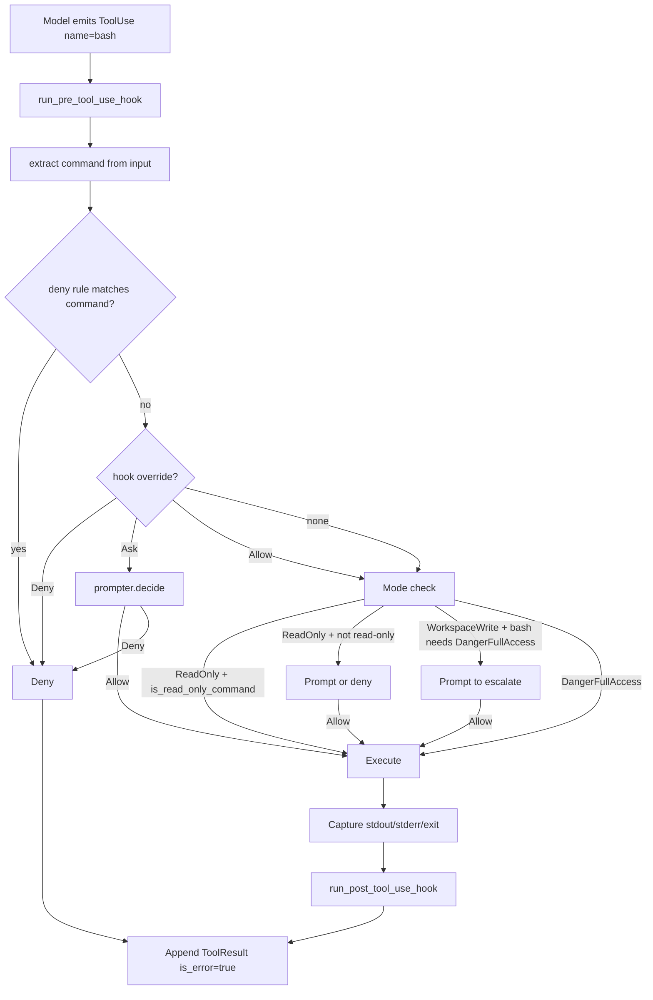
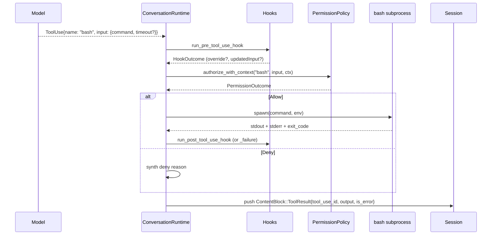

# Command Execution
> Module: 05_action_and_tools | Status: Phase 2 | Last Agent: Claude Code Synthesis

## 1. Overview
Command execution is the action surface that lets an agent run shell or interpreter commands against the user's environment. This document specifies the [CLAUDE] command-execution surface as the Phase 2 reference; Phase 3 will add Codex's sandboxed execution and Phase 6 will add Open Interpreter's multi-language REPL.

[CLAUDE] exposes three command-execution tools at HEAD `a389f8d`, all gated by the `DangerFullAccess` permission tier:

| Tool | Required input | Optional input | Purpose |
| --- | --- | --- | --- |
| `bash` | `command` | `timeout`, `description`, `run_in_background`, `dangerouslyDisableSandbox`, `namespaceRestrictions`, `isolateNetwork`, `filesystemMode`, `allowedMounts` | General-purpose shell command execution. |
| `PowerShell` | `command` | `timeout`, `description`, `run_in_background` | Windows-side command execution. |
| `REPL` | `code`, `language` | `timeout_ms` | Stateful interpreter execution (multi-language). |

(claw-code: `tools/src/lib.rs:387-600` and `603-854`; permission tiers per Part 1 §2 catalog.)

## 2. Blueprint Specification

### `bash` tool [CLAUDE]
- **Permission tier**: `DangerFullAccess`. Even with `--dangerously-skip-permissions`, a `Bash(rm -rf:*)` deny rule or a hook-driven `PermissionOverride::Deny` still blocks dangerous commands (`permissions.rs:182-189`).
- **Input schema** (per Part 1 §2 table):
  - `command: string` — required.
  - `timeout: number` — optional, milliseconds.
  - `description: string` — optional, free-text describing what the command does (used for telemetry and approval UX).
  - `run_in_background: bool` — optional. When true, the command starts and returns immediately; output is collected via a separate read mechanism.
  - `dangerouslyDisableSandbox: bool` — optional, opt-out from any sandbox layer.
  - `namespaceRestrictions`, `isolateNetwork`, `filesystemMode`, `allowedMounts` — optional sandbox-shaping fields recognized in the schema; the actual sandbox enforcement layer in claw-code is the `PermissionEnforcer::check_bash` heuristic, not a kernel-level sandbox (see below).
- **Read-only short-circuit**: under `ReadOnly` mode, `PermissionEnforcer::check_bash` uses an `is_read_only_command` heuristic to allow commands like `cat | grep | git log | …` without escalation (`permission_enforcer.rs:145-201`). This lets the model still navigate the repo in plan mode.
- **Workspace-boundary enforcement**: `check_bash` does not block writes outside the workspace by inspecting the command string — that responsibility falls to the operator via deny-rules and hooks. The complementary `check_file_write(path, workspace_root)` is invoked for filesystem-write tools, not for arbitrary `bash` commands.

### `PowerShell` tool [CLAUDE]
- **Permission tier**: `DangerFullAccess`.
- Mirror of `bash` for Windows hosts; smaller schema (no namespace/sandbox fields exposed at HEAD `a389f8d`).
- Routes through the same hook + permission machinery.

### `REPL` tool [CLAUDE]
- **Permission tier**: `DangerFullAccess`.
- **Input**: `code: string`, `language: string`, optional `timeout_ms: number`.
- This is the multi-language interpreter execution surface in claw-code's catalog. Statefulness across calls within a session is implementation-internal; Phase 6's [OI] research will document multi-language REPL state management at greater depth.

### Permission flow for command tools [CLAUDE]
All three command tools share the same gate sequence (see `agentic_loop.md` §3 step 7):

1. `run_pre_tool_use_hook` — can rewrite `input` via `updatedInput` or override the permission decision.
2. `extract_permission_subject(input)` — for `bash`, this extracts the `command` field as the rule-matchable subject (`permissions.rs:447-469`).
3. `PermissionRule` matching: rule strings like `bash(git:*)` or `Bash(rm -rf)` are parsed by `PermissionRule::parse` (`permissions.rs:349-402`). Matchers: `*`/empty → `Any`, `prefix:*` → `Prefix(prefix)`, otherwise `Exact(value)`. A bare `ToolName` (no parens) becomes `Any`.
4. `authorize_with_context` produces `Allow | Deny | Prompt`. Under `DangerFullAccess` mode (claw-code's default — see `permission_model.md` for the divergence note), an absent matching rule falls through to `Allow`.
5. `tool_executor.execute("bash", input)` runs the command.
6. `run_post_tool_use_hook` (success) or `run_post_tool_use_failure_hook` (error).

### Bash result framing [CLAUDE]
The result string returned to the model contains the captured output. There is no global truncator in `conversation.rs`; per-tool truncation is at each tool's discretion. (Compare: `WebFetch` truncates at 8_192 bytes appending `[response truncated — N bytes total]` per `tools/src/lib.rs:1783-1796`; `bash` typically does not truncate its captured output, so very chatty commands can pressure the context window.)

### Background execution [CLAUDE]
The `bash` tool's `run_in_background: true` flag returns control to the loop without blocking on completion. There is no built-in tool to read background output in the published catalog — the operator is expected to capture output to a file inside the command itself (e.g. `&> /tmp/log.out`).

## 3. Logic Flow

1. **Model emits** `ContentBlock::ToolUse { name: "bash", input: { command, ... } }`.
2. **Pre-hook** runs; may rewrite the command via `updatedInput`.
3. **Subject extraction** picks the `command` string for rule-matching.
4. **Deny rules** check first; on match → `PermissionOutcome::Deny`.
5. **Hook overrides** (`Allow`/`Deny`/`Ask`) apply if present.
6. **Mode check**: under `ReadOnly`, the `is_read_only_command` heuristic decides; under `WorkspaceWrite`, prompt-on-escalate; under `DangerFullAccess`, allow-by-default.
7. **Execute**: the runtime forks the command, captures stdout/stderr (and exit code), respecting `timeout` if set.
8. **Post-hook** runs; result is composed with optional `Hook feedback` sections.
9. **Append** `ContentBlock::ToolResult { tool_use_id, tool_name: "bash", output, is_error }` to the session.

## 4. Flowchart

## 5. Sequence Diagram

## 6. Variations & Trade-offs

| Variation | Benefit | Trade-off |
| --- | --- | --- |
| **Single shell tool with rich schema** [CLAUDE] | One command surface for the model to learn; `description` field aids approval UX. | One permission tier (`DangerFullAccess`) for the whole tool — granularity comes from rules and hooks, not the spec. |
| **Read-only command heuristic** [CLAUDE] | `cat`, `grep`, `git log`, etc. work in plan mode without prompting. | Heuristic-based: a novel "read-only" command like `mycmd --dry-run` won't be auto-allowed; the model has to escalate. |
| **`run_in_background`** [CLAUDE] | Long-running commands don't block the loop. | No built-in "read-back" tool in the public catalog; operator must capture output to a known path. |
| **Sandbox-shaping fields in the schema (`namespaceRestrictions`, etc.)** [CLAUDE] | Forward-compatible with future sandbox layers. | At HEAD `a389f8d` the harness enforcement is permission rules + hooks, not a kernel-level sandbox — see `sandboxing.md` for what each agent actually enforces. Phase 3 [CODEX] will populate this gap. |
| **No built-in output truncator** [CLAUDE] | Faithful command output for debugging. | A noisy command (`find /` etc.) can blow the context window; the operator must wrap with `head` or `2>&1 | tee`. |
| **`PowerShell` parity tool** [CLAUDE] | Windows-host parity for the same loop semantics. | Two tools to gate; rules must be authored for both. |
| **`REPL` for multi-language** [CLAUDE] | One spec covers Python, JS, Shell, etc. via a `language` selector. | Statefulness across calls is opaque from the spec; Phase 6 [OI] will document the REPL state model. |

## 7. Agent Attribution Table

| Agent | Source-backed contribution |
| --- | --- |
| [CLAUDE] | `bash` tool with `command, timeout, description, run_in_background, dangerouslyDisableSandbox, namespaceRestrictions, isolateNetwork, filesystemMode, allowedMounts` schema; `PowerShell` parity for Windows; `REPL { code, language, timeout_ms }` multi-language interpreter; `DangerFullAccess` permission tier for all command tools; `is_read_only_command` heuristic for read-only-mode short-circuit; rule subject extraction picks the `command` field; `run_in_background` for non-blocking commands; per-tool result framing without global truncation. |

> Phase 1 [AIDER]'s `/run` and shell-output decisions, and [BABYAGI]'s text-only execution, are not first-class command-execution tools. Phase 3 [CODEX] will add sandboxed `apply_patch`-style execution; Phase 6 [OI] will add streaming REPL output.
