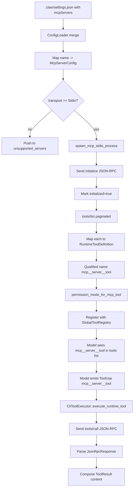

# Extensibility
> Module: 05_action_and_tools | Status: Phase 2 | Last Agent: Claude Code Synthesis

## 1. Overview
Extensibility describes how an agent's tool catalog can grow at runtime — without modifying the harness binary. This document specifies the [CLAUDE] MCP integration as the Phase 2 reference. Phase 4 will add Cline/Roo Code's MCP client variants; Phase 6 will add AutoGPT's plugin system as the contrasting *code-based* extension paradigm.

[CLAUDE] uses the **Model Context Protocol** (MCP) as its primary extension surface. An MCP server is an external process that speaks JSON-RPC 2.0 over stdio (or, in spec, SSE/HTTP/WebSocket — but only stdio is wired up at HEAD `a389f8d`). The harness discovers MCP server configurations from settings files, spawns the configured stdio servers on first use, requests their tool list, registers each tool as a `RuntimeToolDefinition` with a qualified name `mcp__<server>__<tool>`, and then those qualified names appear alongside built-in tools on `MessageRequest.tools` (claw-code: `rust/crates/runtime/src/mcp_stdio.rs`, `mcp.rs`, `mcp_tool_bridge.rs`).

## 2. Blueprint Specification

### Settings shape [CLAUDE]
- **Top-level key**: `mcpServers` in any merged settings file (`config.rs:709-733`).
- **Per-entry**: object map of `name -> server-spec`.
- Each entry is wrapped as `ScopedMcpServerConfig { scope: ConfigSource::{User, Project, Local}, config: McpServerConfig }`. Last-defined scope wins per the standard settings-merge order (`config.rs:103-106`).

### Server-config variants [CLAUDE]
`McpServerConfig` (`config.rs:120-128`):

| Variant | Discriminator (`type`) | Fields |
| --- | --- | --- |
| `Stdio` | `"stdio"` | `command, args[], env{}, toolCallTimeoutMs?` |
| `Sse` | `"sse"` | `url, headers, headersHelper?, oauth?{...}` |
| `Http` | `"http"` (default if `url` present) | same as `Sse` |
| `Ws` | `"ws"` | `url, headers, headersHelper?` |
| `Sdk` | `"sdk"` | `name` |
| `ManagedProxy` | `"claudeai-proxy"` | `url, id` |

Type inference: when `type` is absent, `infer_mcp_server_type` returns `"http"` if `url` is present else `"stdio"` (`config.rs:992-998`).

### Transport actually implemented [CLAUDE]
**Only `stdio` connects in practice.** `McpServerManager::from_servers` filters `server_config.transport() == McpTransport::Stdio` and pushes everything else to `unsupported_servers` with reason `"transport <T> is not supported by McpServerManager"` (`mcp_stdio.rs:494-512`). `Sse`, `Http`, `Ws`, `Sdk`, `ManagedProxy` parse from JSON but do not connect at HEAD `a389f8d`.

### Stdio server lifecycle [CLAUDE]
Single entry point: `ensure_server_ready(server_name)` runs before any RPC (`mcp_stdio.rs:1057-1069`):

1. **Reset on death**: if the prior process exited, `reset_server` clears it.
2. **Spawn**: if `process` is `None`, call `spawn_mcp_stdio_process(&bootstrap)` (`mcp_stdio.rs:1371-1389`).
3. **Initialize**: if `initialized == false`, send `initialize` JSON-RPC with `default_initialize_params() = { protocol_version: "2025-03-26", capabilities: {}, client_info: { name: "runtime", version: <crate-version> } }` (`mcp_stdio.rs:22-29, 1397-1406`). Timeout `MCP_INITIALIZE_TIMEOUT_MS` — 200 ms in test profile, 10_000 ms in release.
4. **Mark ready**: set `initialized = true`. **No `notifications/initialized` notification is sent** — handshake ends after the response (divergence from the spec).

### Tool discovery [CLAUDE]
`discover_tools_for_server_once(server_name)` issues `tools/list` requests with cursor-based pagination. Timeout `MCP_LIST_TOOLS_TIMEOUT_MS` — 300 ms test, 30_000 ms release (`mcp_stdio.rs:806-872`).

Each returned tool becomes a `ManagedMcpTool { server_name, qualified_name, raw_name, tool }`. `discover_tools` aggregates over all configured servers and rebuilds `tool_index: BTreeMap<qualified_name, ToolRoute>` (`mcp_stdio.rs:532-553`). `discover_tools_best_effort` collects per-server failures into an `McpToolDiscoveryReport` so partial connectivity does not abort the run (`mcp_stdio.rs:555-617`).

### Qualified-name format [CLAUDE]
`mcp_tool_name(server_name, tool_name)` = `format!("mcp__{server}__{tool}")` after both halves are run through `normalize_name_for_mcp` (replace any non-`[a-zA-Z0-9_-]` with `_`; collapse runs of `_` and trim them iff the name starts with `claude.ai `) (claw-code: `rust/crates/runtime/src/mcp.rs:7-37`). This is the literal name that appears in the model-facing tool list (e.g. `mcp__Claude_Preview__preview_screenshot`).

### Bridge to runtime tool registry [CLAUDE]
In `main.rs`, `build_runtime_mcp_state(runtime_config)` builds an `McpServerManager`, runs `discover_tools_best_effort`, then maps each `ManagedMcpTool` to a `RuntimeToolDefinition` via `mcp_runtime_tool_definition` (`main.rs:3969-4004`):

- Description falls back to `Invoke MCP tool \`{qualified_name}\`.`
- Input schema falls back to `{type: "object", additionalProperties: true}` if not provided by the server.
- Permission tier per `permission_mode_for_mcp_tool(tool)` (`main.rs:4056-4076`):
  - `readOnlyHint && !destructive && !openWorld` → `ReadOnly`.
  - `destructive || openWorld` → `DangerFullAccess`.
  - Otherwise → `WorkspaceWrite`.
- Annotations come from the MCP `tool.annotations` map (`main.rs:4070-4076`).

### Wrapper tools alongside MCP tools [CLAUDE]
When at least one MCP server is configured, `mcp_wrapper_tool_definitions()` adds three runtime-side defs — `MCPTool`, `ListMcpResourcesTool`, `ReadMcpResourceTool` — with their own input schemas (`main.rs:4006-4054`). These are *separate* from the built-in `mvp_tool_specs` entries `MCP`, `ListMcpResources`, `ReadMcpResource`, `McpAuth` (Part 1 §2 catalog).

> **Divergence note** (from research): the model thus sees both naming conventions (built-in spec `MCP` and runtime wrapper `MCPTool`) for the same generic-MCP entrypoint at HEAD `a389f8d`.

### JSON-RPC framing [CLAUDE]
- LSP-style: `Content-Length: <n>\r\n\r\n<payload>`.
- `encode_frame` wraps payload bytes with the header.
- `read_response` parses headers then a JSON body of `JsonRpcResponse { jsonrpc: "2.0", id, result?, error? }` (`mcp_stdio.rs:1390-1395`).
- Per-method wrappers: `initialize`, `list_tools`, `call_tool`, `list_resources`, `read_resource` (`mcp_stdio.rs:1306-1344`).

### Lifecycle phase tracking [CLAUDE]
Every method maps to `McpLifecyclePhase::{InitializeHandshake, ToolDiscovery, ResourceDiscovery, Invocation, ServerRegistration, ErrorSurfacing}` for telemetry (`mcp_stdio.rs:432-440`).

### Production execution split [CLAUDE]
Qualified MCP runtime tools (`mcp__server__tool`) and the runtime wrappers above are executed through `RuntimeMcpState::call_tool` / `CliToolExecutor::execute_runtime_tool`, which use the `McpServerManager` built from the merged config (`main.rs:3780-3906, 8693-8731`).

The built-in `MCP`, `ListMcpResources`, and `ReadMcpResource` specs execute through `tools::global_mcp_registry()`, but **production code does not call `global_mcp_registry().set_manager(...)` or `register_server(...)`**; those calls appear only in `mcp_tool_bridge.rs` tests. For real configured MCP servers, the runtime-qualified tools and wrappers are the accurate path.

### `MCP::call_tool` execution flow (built-in spec) [CLAUDE]
The unified `MCP { server, tool, arguments }` entry validates the server is `Connected` and the tool exists in the registry's cached tool list, then `spawn_tool_call(manager, qualified_name, arguments)`:

1. Boots a fresh `tokio::runtime::Builder::new_current_thread()` on a dedicated `mcp-tool-call-<qualified>` OS thread.
2. `discover_tools` (per-call rediscovery).
3. `manager.call_tool(qualified, arguments)`.
4. `manager.shutdown()`.
5. Block-and-join.

(`runtime/src/mcp_tool_bridge.rs:177-238`.) **Each call therefore re-spawns the stdio process** (because `shutdown` kills the child). This is a notable divergence from the long-lived `McpServerManager` path.

### Shutdown [CLAUDE]
`McpServerManager::shutdown` and `McpStdioProcess::shutdown` both `child.kill().await` then `child.wait()` (`mcp_stdio.rs:1346-1368`). **No graceful `shutdown` JSON-RPC method is sent.**

### `/mcp` slash command [CLAUDE]
- Dispatched to `handle_mcp_slash_command(args, cwd)` (`commands/src/lib.rs:4030-4067`).
- Inspects merged `RuntimeConfig.mcp().servers()` map.
- Emits text or JSON describing each server: name, scope, transport, summary, oauth-config presence.
- **Read-only** — does not connect or call tools.

## 3. Logic Flow

### Server bootstrap (lazy, on first need)
1. Settings merged via `ConfigLoader` — `mcpServers` map populates `RuntimeConfig.mcp().servers()`.
2. `McpServerManager::from_servers` filters by transport — only `Stdio` proceeds; others go to `unsupported_servers`.
3. CLI startup calls `build_runtime_mcp_state` which runs `discover_tools_best_effort` synchronously: every configured stdio server is spawned, initialized, and `tools/list` is paginated. Failures are collected, not raised.
4. Each tool becomes a `RuntimeToolDefinition` with qualified name `mcp__<server>__<tool>`.
5. The runtime tool list is appended to the registry's `definitions(...)` output before sending to the model.

### Per-call dispatch
1. Model emits `ContentBlock::ToolUse { name: "mcp__myserver__doit", input }`.
2. `CliToolExecutor::execute` tries `execute_runtime_tool` first.
3. `RuntimeMcpState::call_tool(qualified_name, arguments)` re-uses the long-lived stdio process.
4. JSON-RPC `tools/call` request is framed with `Content-Length` header.
5. Response is read, framed, parsed.
6. Result string is composed and returned to the loop, where it becomes a `ContentBlock::ToolResult`.

## 4. Flowchart


## 5. Sequence Diagram
```mermaid
sequenceDiagram
    participant CLI
    participant Mgr as McpServerManager
    participant Proc as MCP server stdio
    participant Reg as GlobalToolRegistry
    participant Runtime as ConversationRuntime
    participant Model
    participant Exec as CliToolExecutor

    CLI->>Mgr: from_servers(settings)
    Mgr->>Mgr: filter Stdio only; others unsupported
    Mgr->>Proc: spawn(command, args, env)
    Mgr->>Proc: JSON-RPC initialize {protocol_version: "2025-03-26"}
    Proc-->>Mgr: initialize response (no notifications/initialized sent)
    Mgr->>Proc: tools/list (paginated)
    Proc-->>Mgr: tools array
    Mgr->>Reg: register RuntimeToolDefinition with mcp__server__tool name

    Runtime->>Model: stream(MessageRequest with tools incl mcp__server__tool)
    Model-->>Runtime: ToolUse{name: mcp__server__tool, input}
    Runtime->>Exec: execute_runtime_tool
    Exec->>Mgr: call_tool(qualified_name, arguments)
    Mgr->>Proc: JSON-RPC tools/call
    Proc-->>Mgr: result
    Mgr-->>Exec: output string
    Exec-->>Runtime: Ok(output)
    Runtime->>Runtime: append ContentBlock::ToolResult
```

## 6. Variations & Trade-offs

| Variation | Benefit | Trade-off |
| --- | --- | --- |
| **Stdio-only transport** [CLAUDE] | Simple, robust, parent process owns lifecycle. | Remote MCP servers (SSE / HTTP / WebSocket) parse from settings but don't connect; cross-host MCP requires a stdio shim. |
| **Qualified-name format `mcp__server__tool`** [CLAUDE] | Server origin is visible in every model-side tool name; permission rules can target servers. | Long names eat context window per tool; rule-authoring requires escaping rules for the double underscore. |
| **Per-call MCP stdio in `MCP::call_tool` (built-in spec)** [CLAUDE] | Isolated, no cross-call state leaks via the manager. | Spawns and tears down the server process every call — high latency for chatty servers. The runtime-qualified path uses a long-lived manager and avoids this. |
| **`discover_tools_best_effort` over per-server failures** [CLAUDE] | A broken server doesn't abort the whole run. | Operator must check the discovery report; silent partial failures are easy to miss. |
| **Three permission tiers from MCP `annotations`** [CLAUDE] | Model-facing permission tier reflects the server's self-declared safety. | Server can self-declare `readOnlyHint: true` dishonestly; deny-rules at the operator level remain the trust anchor. |
| **No `notifications/initialized` after handshake** [CLAUDE] | One fewer round-trip on cold-start. | Strict spec-conformant servers may reject subsequent calls. |
| **No graceful shutdown JSON-RPC** [CLAUDE] | Predictable: `kill` always works. | Servers with persistent state may not flush; operator must handle in-server. |

## 7. Agent Attribution Table

| Agent | Source-backed contribution |
| --- | --- |
| [CLAUDE] | `mcpServers` settings shape with `Stdio` / `Sse` / `Http` / `Ws` / `Sdk` / `ManagedProxy` variants; stdio-only actual transport at HEAD `a389f8d`; `ensure_server_ready` lazy bootstrap; `tools/list` cursor-paginated discovery with `discover_tools_best_effort` partial-failure tolerance; `mcp__<server>__<tool>` qualified-name format with `normalize_name_for_mcp` rules; `mcp_runtime_tool_definition` mapping incl. `permission_mode_for_mcp_tool` annotation-driven tier; `MCPTool`/`ListMcpResourcesTool`/`ReadMcpResourceTool` runtime wrappers alongside built-in `MCP`/`ListMcpResources`/`ReadMcpResource` specs; LSP-style `Content-Length` JSON-RPC framing; per-call re-spawn in `MCP::call_tool` vs long-lived manager in `execute_runtime_tool`; read-only `/mcp` inspector slash command. |

> Phase 4 [CLINE] and [ROO] will add IDE-side MCP client variants for comparison; Phase 6 [AUTOGPT] will add the contrasting *code-based* plugin paradigm.
