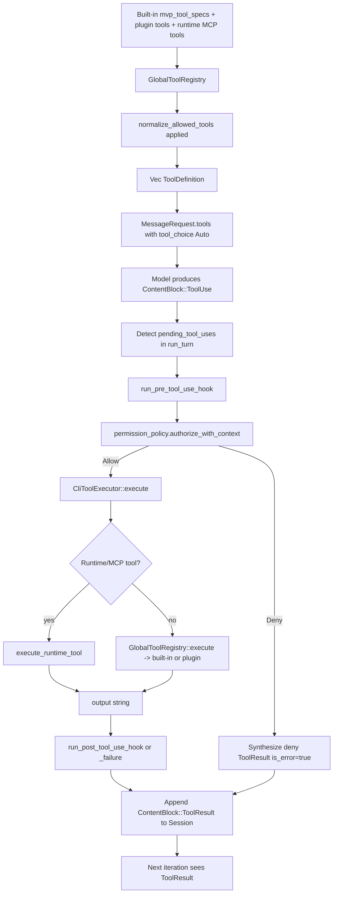
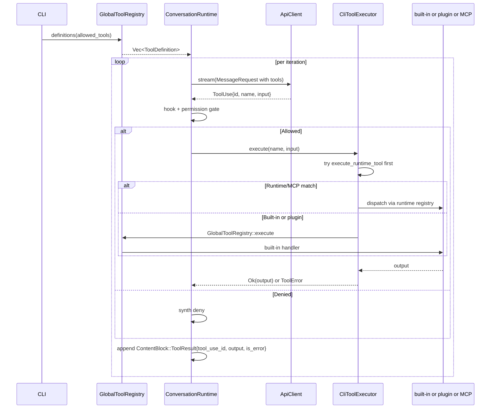

# Tool Architecture
> Module: 05_action_and_tools | Status: Phase 2 | Last Agent: Claude Code Synthesis

## 1. Overview
Tool architecture describes the full lifecycle of a tool from declaration to invocation: how a tool is defined, advertised to the model, gated by permissions, dispatched, and how its result is fed back into the loop. This document specifies the [CLAUDE] tool architecture as the Phase 2 reference; later phases will add Codex's autonomy-gated tools, Cline's per-action approval, AutoGPT's plugin system, OpenCode's TUI-driven tool surface, and Pi Agent's tool-calling runtime.

[CLAUDE] tool architecture is a **typed-spec registry** (`GlobalToolRegistry`) plus a **runtime executor** (`ToolExecutor` trait), connected through the agentic loop's permission gate. The model sees tool definitions as structured JSON schemas via Anthropic's native `tools` field, not as text in the system prompt; tool calls arrive as `ContentBlock::ToolUse { id, name, input }` blocks; tool results are appended as `ContentBlock::ToolResult { tool_use_id, tool_name, output, is_error }` blocks correlated by `tool_use_id` (claw-code: `rust/crates/runtime/src/conversation.rs:375-499`; `session.rs:18-25, 38-43`).

> Naming convention note (from research, Part 1 §2): the upstream task.md asks for "Read, Write, Edit, Bash, Glob, Grep, etc." (Title-cased). The claw-code Rust harness exposes them under snake_case canonical names (`read_file`, `write_file`, `edit_file`, `bash`, `glob_search`, `grep_search`); upstream-style aliases are mapped only at the `--allowedTools` parsing layer (`tools/src/lib.rs:216-224`).

## 2. Blueprint Specification

### `ToolSpec` shape [CLAUDE]
Each built-in tool is declared as a `ToolSpec { name, description, input_schema, required_permission }` (`tools/src/lib.rs:101-106`). The fields:

| Field | Purpose |
| --- | --- |
| `name` | Canonical model-facing name (snake_case for claw-code built-ins; `mcp__server__tool` for MCP-bridged tools). |
| `description` | Free-text description sent to the model alongside the schema. |
| `input_schema` | JSON Schema describing inputs and required fields. |
| `required_permission` | Minimum `PermissionMode` needed to authorize this tool: `ReadOnly`, `WorkspaceWrite`, or `DangerFullAccess`. |

### Three sources of tool definitions [CLAUDE]
The registry composes definitions from three sources, all visible to the model on a single `MessageRequest.tools` field:

1. **Built-in specs** — `tools::mvp_tool_specs()` returns `Vec<ToolSpec>` with **50 live built-in specs** at HEAD `a389f8d` (`tools/src/lib.rs:385-1171`). Citation audit: the repo's top-level `PARITY.md:145-150` claims 40 — that count is stale; treat the source registry as authoritative.
2. **Plugin tools** — registered through plugin manifests; conflict-checked against built-in names.
3. **Runtime MCP tools** — registered via `with_runtime_tools(...)` after MCP server discovery (`tools/src/lib.rs:159-184`). These appear with qualified names `mcp__<server>__<tool>`.

`GlobalToolRegistry::definitions(allowed_tools)` produces the combined `Vec<ToolDefinition>`, applying the optional `--allowedTools` filter (`tools/src/lib.rs:247-278`). The CLI's `filter_tool_specs` delegates to this registry (`main.rs:1608-1612`).

### How tool definitions reach the model [CLAUDE]
The Anthropic-flavored API client puts the registry result into `MessageRequest.tools` with `tool_choice: Auto` when tools are enabled (`AnthropicRuntimeClient::stream`, `main.rs:7518-7526`). The model never sees tool docs as text in the system prompt — they are sent as a structured field on the request body, allowing the provider to marshal them into native tool-use semantics.

### Tool-call dispatch [CLAUDE]
The runtime calls dispatch through two layers:

1. **`ToolExecutor` trait** (`conversation.rs:58`):
   ```
   async fn execute(&mut self, name: &str, input: &str) -> Result<String, ToolError>
   ```
   The CLI binds `CliToolExecutor` (`main.rs:7315-7320, 8735-8756`).

2. **`CliToolExecutor::execute`** dispatches in this order (`main.rs:8693-8731, 8735-8756`):
   - Try `execute_runtime_tool` for runtime/MCP-registered tools first.
   - Fall back to `GlobalToolRegistry::execute(name, input)` for built-ins and plugins (`tools/src/lib.rs:339-349`).

The built-in `MCP`, `ListMcpResources`, and `ReadMcpResource` specs go through `tools::global_mcp_registry()` for execution; for *real* configured MCP servers, the runtime-qualified path `mcp__server__tool` is the production execution route (see `extensibility.md`).

### Built-in catalog summary [CLAUDE]
The 50 built-in specs are grouped by domain (full table in research Part 1 §2):

| Domain | Tools |
| --- | --- |
| File I/O | `read_file`, `write_file`, `edit_file`, `glob_search`, `grep_search`, `NotebookEdit` |
| Command execution | `bash`, `PowerShell`, `REPL` |
| Web | `WebFetch`, `WebSearch` |
| Planning / cognition | `TodoWrite`, `Skill`, `Agent`, `ToolSearch`, `EnterPlanMode`, `ExitPlanMode`, `StructuredOutput`, `AskUserQuestion`, `Sleep`, `SendUserMessage`, `Config` |
| Task registry (bookkeeping) | `TaskCreate`, `RunTaskPacket`, `TaskGet`, `TaskList`, `TaskStop`, `TaskUpdate`, `TaskOutput` |
| Worker harness (external) | `WorkerCreate`, `WorkerGet`, `WorkerObserve`, `WorkerResolveTrust`, `WorkerAwaitReady`, `WorkerSendPrompt`, `WorkerRestart`, `WorkerTerminate`, `WorkerObserveCompletion` |
| Teams / Cron | `TeamCreate`, `TeamDelete`, `CronCreate`, `CronDelete`, `CronList` |
| Editor / language | `LSP` |
| MCP-facing built-ins | `ListMcpResources`, `ReadMcpResource`, `McpAuth`, `MCP` |
| Network / test | `RemoteTrigger`, `TestingPermission` |

### Allowed-tools normalization [CLAUDE]
`normalize_allowed_tools(values)` accepts comma- or whitespace-separated tokens and resolves aliases `read|write|edit|glob|grep` → snake_case canonical names (`tools/src/lib.rs:192-244`). The CLI exposes this through `--allowedTools` / `--allowed-tools` (`main.rs:773-784`). A tool absent from the allowed set is simply not advertised to the model.

### Tool-call shape on the wire [CLAUDE]
- **Outbound** (model → harness): `ContentBlock::ToolUse { id: String, name: String, input: serde_json::Value }`.
- **Inbound** (harness → model, on next iteration): `ContentBlock::ToolResult { tool_use_id: String, tool_name: String, output: String, is_error: bool }`.
- **Wire format for Anthropic**: `convert_messages` maps the harness's `MessageRole::Tool` to provider role `"user"` while preserving the tool-result content block (`main.rs:8793-8831`).

## 3. Logic Flow

1. **Definition load** (once per turn): `GlobalToolRegistry::definitions(allowed_tools)` aggregates built-ins + plugins + runtime MCP, filters by `--allowedTools`, returns `Vec<ToolDefinition>`.
2. **Request construction** (per iteration): `MessageRequest.tools = definitions; tool_choice = Auto`.
3. **Stream parse**: `AssistantEvent::ToolUse { id, name, input }` events become `ContentBlock::ToolUse` blocks in the assistant message.
4. **Permission gate**: `permission_policy.authorize_with_context(name, input, ctx, prompter)` runs (`permissions.rs:175-292`); see `permission_model.md`.
5. **Hook gate**: `run_pre_tool_use_hook` runs before the permission gate proper, can override the decision via `PermissionOverride::{Allow, Deny, Ask}` and may rewrite `input` via `updatedInput`. See `audit_and_observability.md`.
6. **Execute**: `tool_executor.execute(name, input)` runs the tool; returns `Result<String, ToolError>`.
7. **Post-hook**: `run_post_tool_use_hook` (success) or `run_post_tool_use_failure_hook` (error); `merge_hook_feedback` appends labelled hook output to the result.
8. **Append result**: `ConversationMessage::tool_result(tool_use_id, tool_name, output, is_error)` is pushed to `Session::messages`.
9. **Re-enter loop**: next iteration's request includes the tool result; the model decides to continue, retry, or terminate.

## 4. Flowchart


## 5. Sequence Diagram


## 6. Variations & Trade-offs

| Variation | Benefit | Trade-off |
| --- | --- | --- |
| **Typed `ToolSpec` registry** [CLAUDE] | Schema-validated inputs, model-native rendering, self-documenting catalog. | Adding a tool requires Rust code; no runtime "register a tool from JSON" path for built-ins. |
| **Three-source composition (built-in / plugin / MCP)** [CLAUDE] | Same model-facing surface for all tools; the model doesn't know whether a tool is in-process or over JSON-RPC. | Naming collisions across sources are policed at registration time (`with_runtime_tools` checks; `tools/src/lib.rs:159-184`); silent failures if checks miss. |
| **`tool_choice: Auto`** [CLAUDE] | Lets the model decide whether to call a tool or emit text only — natural termination. | Cannot force a tool call without changing this; no `tool_choice: { type: "tool", name: "X" }` enforcement at HEAD. |
| **Three permission tiers per spec** [CLAUDE] | Tier per tool means a single `PermissionMode` can authorize the whole catalog without per-call config. | Coarse-grained: any `bash` invocation requires `DangerFullAccess` regardless of the actual command; finer gating belongs in deny-rules and hooks. |
| **`--allowedTools` filter** [CLAUDE] | Reduces the model's option space and prompt token cost. | If the user filters out a tool the system prompt assumes is available (e.g. `read_file`), the model may try and fail; harness will deny gracefully but the user-visible flow stalls. |

## 7. Agent Attribution Table

| Agent | Source-backed contribution |
| --- | --- |
| [CLAUDE] | `ToolSpec { name, description, input_schema, required_permission }` declaration shape; `GlobalToolRegistry` three-source composition (50 built-ins + plugins + runtime MCP); `ToolExecutor::execute` async trait; `CliToolExecutor` runtime/MCP-first dispatch order; `MessageRequest.tools` + `tool_choice: Auto` provider-native delivery; snake_case canonical names + alias resolution at `--allowedTools` boundary; `ContentBlock::ToolUse` / `ContentBlock::ToolResult` correlation via `tool_use_id`. |

> [AIDER]'s edit-format-as-tools (whole/diff/udiff/search-replace) is documented in `code_modification.md`; [BABYAGI] has no first-class tool layer and is intentionally absent from this module. Phase 5's [OPENCODE] TUI-driven tool surface, Phase 6's [AUTOGPT] plugin pattern, and [PI]'s tool-calling runtime will extend this document.
