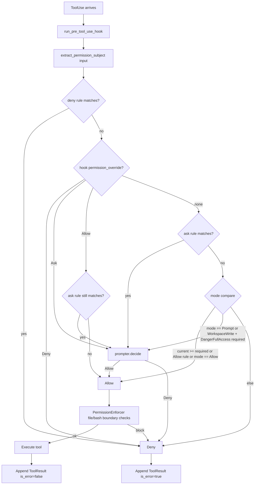
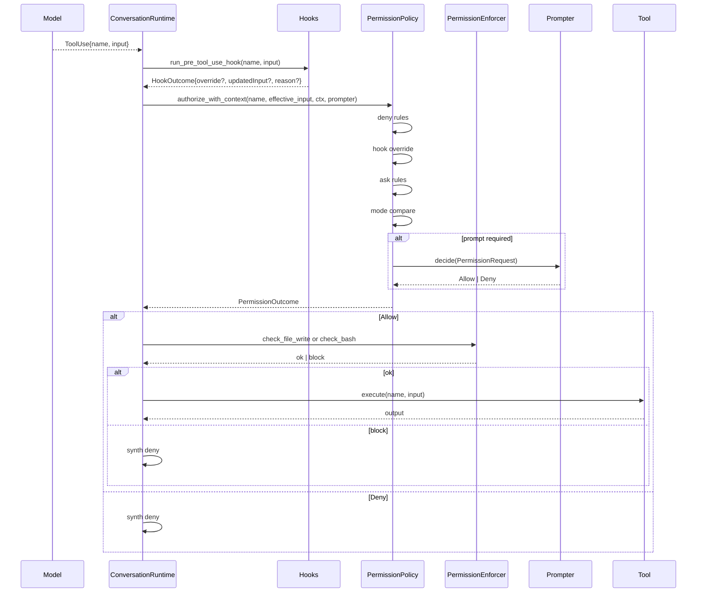

# Permission Model
> Module: 07_permissions_and_governance | Status: Phase 2 | Last Agent: Claude Code Synthesis

## 1. Overview
A permission model is the policy layer that decides whether a given tool invocation is allowed, denied, or escalated to the user. This document specifies the [CLAUDE] mode-based permission system as the Phase 2 reference. Phase 3 will add Codex's autonomy-level system; Phase 4 will add Cline's per-action approval; Phase 5 will add Kilo Code's file-level permissions.

[CLAUDE] uses a five-variant `PermissionMode` enum (three CLI-exposed) backed by deny/allow/ask rule lists, with hooks acting as a per-call override layer. The full ordered evaluation in `PermissionPolicy::authorize_with_context` runs (claw-code: `rust/crates/runtime/src/permissions.rs:175-292`):

> deny rule → hook deny → hook ask → hook allow → ask rule → mode/allow rule → default deny

A separate `PermissionEnforcer` layer adds workspace-boundary checks for filesystem-write tools and a read-only-command heuristic for `bash` (`permission_enforcer.rs:108-201`).

> **task.md asks for "3 modes (default, permissive, auto)"** — the source actually defines five `PermissionMode` variants with three CLI-exposed labels. This document reports source reality.

## 2. Blueprint Specification

### `PermissionMode` enum [CLAUDE]
`PermissionMode::{ReadOnly, WorkspaceWrite, DangerFullAccess, Prompt, Allow}` with `as_str` labels `"read-only" | "workspace-write" | "danger-full-access" | "prompt" | "allow"` (claw-code: `rust/crates/runtime/src/permissions.rs:9-28`).

| Variant | CLI label | Reachable from CLI flag? | Meaning |
| --- | --- | --- | --- |
| `ReadOnly` | `read-only` | Yes | Read tools allowed; write tools denied; `bash` allowed only if `is_read_only_command` heuristic passes. |
| `WorkspaceWrite` | `workspace-write` | Yes | Read + workspace-bounded writes allowed; bash and other `DangerFullAccess` tools require prompting. |
| `DangerFullAccess` | `danger-full-access` | Yes | All tool tiers allowed by default; deny rules and hooks still apply. |
| `Prompt` | `prompt` | No (runtime-internal) | Every tool requires prompting. |
| `Allow` | `allow` | No (runtime-internal) | All tools allowed unconditionally (modulo deny rules). |

`Prompt` and `Allow` are runtime-internal — only the first three are reachable from the CLI flag (`main.rs:1525-1542`).

### Settings-file mode parsing [CLAUDE]
`parse_optional_permission_mode` first checks top-level `permissionMode`, then `permissions.defaultMode` (`config.rs:831-863`). Accepted values map as:

| Settings value | → `PermissionMode` |
| --- | --- |
| `"default"` / `"plan"` / `"read-only"` | `ReadOnly` |
| `"acceptEdits"` / `"auto"` / `"workspace-write"` | `WorkspaceWrite` |
| `"dontAsk"` / `"danger-full-access"` | `DangerFullAccess` |

> **task.md's "default, permissive, auto" trio** corresponds to settings-file *aliases*, not CLI mode names. `default` → `ReadOnly`, `auto` → `WorkspaceWrite`. There is no settings alias spelled "permissive."

### Default mode (CLI) [CLAUDE]
`default_permission_mode()` resolves in this order (`main.rs:1552-1559`):

1. `RUSTY_CLAUDE_PERMISSION_MODE` env var.
2. Merged config's `permissionMode` field.
3. Merged config's `permissions.defaultMode` field.
4. Built-in default: **`PermissionMode::DangerFullAccess`**.

> **Divergence**: upstream Claude Code defaults to a prompting/plan mode; **claw-code defaults to full access**. This is documented in the research as a deliberate harness-specific choice.

### Settings precedence (last-wins deep merge) [CLAUDE]
`ConfigLoader::discover()` orders entries (`config.rs:242-269`):

1. User legacy `<HOME>/.claw.json`.
2. User `<config_home>/settings.json`.
3. Project `<cwd>/.claw.json`.
4. Project `<cwd>/.claw/settings.json`.
5. Local `<cwd>/.claw/settings.local.json`.

`load()` deep-merges in that order so later entries override earlier — **local > project > user** (`config.rs:271-296`; verified by `loads_and_merges_claude_code_config_files_by_precedence`, `config.rs:1296-1395`).

`<config_home>` is `$CLAW_CONFIG_HOME` else `$HOME/.claw` (`config.rs:561-563`).

### Project path branding [CLAUDE]
**claw-code uses `.claw/` not `.claude/`** for settings:

| Path | Purpose |
| --- | --- |
| `.claw/settings.json` | Project settings (committed). |
| `.claw/settings.local.json` | Local override (typically gitignored). |
| `~/.claw/settings.json` | User settings. |
| `.claw.json` (project + user roots) | Legacy alias for back-compat. |

(`config.rs:243-269`.)

> **Managed/enterprise paths**: **Not implemented in claw-code at HEAD `a389f8d`**. No `/etc/claude`, `/Library/Application Support/ClaudeCode`, or `%PROGRAMDATA%\ClaudeCode` paths are loaded. `ConfigLoader::discover` enumerates exactly the five paths above.

### Allow / deny / ask rules [CLAUDE]
- **Settings shape**: `permissions.{allow, deny, ask}: string[]` (`config.rs:780-798`).
- **Rule grammar** (`PermissionRule::parse`, `permissions.rs:349-402`):
  - `ToolName(matcher)` where:
    - `*` or empty → `Any`.
    - `prefix:*` → `Prefix(prefix)`.
    - Otherwise → `Exact(value)`.
  - Bare `ToolName` (no parens) → `Any`.
- **Rule subject extraction** (`extract_permission_subject`, `permissions.rs:447-469`): for each tool input, JSON-parses and probes keys in this order — `command`, `path`, `file_path`, `filePath`, `notebook_path`, `notebookPath`, `url`, `pattern`, `code`, `message` — falling back to the raw input string.
- **Example rules** (test fixtures, `permissions.rs:570-605`):
  - `"Read"` (ToolName-only).
  - `"bash(git:*)"` (prefix).
  - `"bash(rm -rf:*)"` (prefix deny).
  - `"Edit"` (ask).
- **Settings JSON shape used in tests** (`config.rs:1310, 1320`):
  ```json
  {
    "permissions": {
      "defaultMode": "plan",
      "allow": ["Read"],
      "deny": ["Bash(rm -rf)"],
      "ask": ["Edit"]
    }
  }
  ```

### Authorization order [CLAUDE]
`PermissionPolicy::authorize_with_context` (`permissions.rs:175-292`):

1. **Any matching deny rule** → `Deny`.
2. **Hook `PermissionOverride::Deny`** → `Deny`.
3. **Hook `Ask`** → prompt-or-deny (depends on prompter).
4. **Hook `Allow`** → `Allow` unless an ask rule matches (then prompt).
5. **Default**:
   - Matching ask rule → prompt.
   - Allow rule, OR `current_mode == Allow`, OR `current_mode >= required_mode` → `Allow`.
   - `current_mode == Prompt`, OR `WorkspaceWrite -> DangerFullAccess` escalation → prompt.
   - Else → `Deny`.

### Prompter contract [CLAUDE]
- `PermissionPrompter::decide(&PermissionRequest) -> PermissionPromptDecision::{Allow, Deny { reason }}` (`permissions.rs:69-88`).
- `PermissionRequest` carries `tool_name, input, current_mode, required_mode, reason`.
- **Without a prompter, prompt-required outcomes hard-deny** (`permissions.rs:310-323`).

### Workspace-boundary enforcement [CLAUDE]
`PermissionEnforcer::check_file_write(path, workspace_root)` (`permission_enforcer.rs:108-142`):

| Mode | Behavior |
| --- | --- |
| `WorkspaceWrite` | Denies writes outside workspace; allows inside. |
| `ReadOnly` | Denies all writes. |
| `Allow` / `DangerFullAccess` | Allows writes anywhere. |
| `Prompt` | Denies with reason `"file write requires confirmation in prompt mode"`. |

`check_bash` uses `is_read_only_command` to allow `cat | grep | git log | …` even under `ReadOnly` (`permission_enforcer.rs:145-201`).

### Autonomy / mode-resolution precedence (effective) [CLAUDE]
1. CLI flag (`--dangerously-skip-permissions` or `--permission-mode <value>`).
2. `RUSTY_CLAUDE_PERMISSION_MODE` env var.
3. Merged config (`permissionMode` then `permissions.defaultMode`).
4. Built-in default `DangerFullAccess`.

(`main.rs:611-693, 1552-1559`.)

### `--dangerously-skip-permissions` [CLAUDE]
Sets `permission_mode_override = Some(PermissionMode::DangerFullAccess)` (`main.rs:691-694`). It bypasses prompting and rule-driven escalation (because `DangerFullAccess >= required_mode` for every built-in tool), but it does **not** bypass:

- Deny rules in `permissions.deny`.
- Hook-driven `PermissionOverride::Deny`.
- Workspace-boundary checks in `PermissionEnforcer::check_file_write`.

These evaluate before / orthogonally to the active mode (`permissions.rs:182-189`, `permission_enforcer.rs:108-142`). **`--dangerously-skip-permissions` is therefore not a true YOLO bypass — it is "skip the prompter and the mode escalation gate."**

### `--permission-mode <value>` [CLAUDE]
Accepts exactly `read-only | workspace-write | danger-full-access`; any other value is rejected with `"unsupported permission mode '<value>'. Use read-only, workspace-write, or danger-full-access."` (`main.rs:1525-1542, 6119`). Aliases (`plan`, `acceptEdits`, `dontAsk`, `auto`) are accepted only in settings JSON, not on the CLI.

### `--allowedTools` interaction [CLAUDE]
Orthogonal to mode — restricts the tool catalog exposed to the model (`tools/src/lib.rs:192-244`, `main.rs:773-784`). A tool absent from the allowed set is simply not advertised, regardless of mode.

### Residual gates under `DangerFullAccess` [CLAUDE]
Even with the flag set, the loop still runs hooks (`run_pre_tool_use_hook` / `run_post_tool_use_hook`), and any deny rule or hook-deny still produces `PermissionOutcome::Deny` (`conversation.rs:401-445`, `permissions.rs:182-189`).

## 3. Logic Flow

For each tool invocation in the loop:

1. **Pre-hook fires** with `(tool_name, input)`; output may carry `permission_override`/`permission_reason` and `updatedInput`.
2. **`effective_input`** is `pre_hook_result.updated_input()` if rewritten, else original.
3. **`extract_permission_subject(input)`** picks the rule-matching subject (e.g. `command` for `bash`).
4. **`PermissionPolicy::authorize_with_context(name, effective_input, ctx, prompter)`** runs the ordered evaluation.
5. **Outcome** is `Allow`, `Deny { reason }`, or (via prompter) decided live.
6. **`PermissionEnforcer`** layer adds boundary checks for filesystem writes and read-only-mode bash heuristic.
7. **On `Allow`** → tool executes.
8. **On `Deny`** → synthesized `ContentBlock::ToolResult { is_error: true, output: <reason> }`.

## 4. Flowchart


## 5. Sequence Diagram


## 6. Variations & Trade-offs

| Pattern | Benefit | Trade-off |
| --- | --- | --- |
| **5-variant mode enum, 3 CLI-exposed** [CLAUDE] | Internal `Prompt` and `Allow` modes give hooks fine-grained control without polluting the user-facing CLI surface. | Naming divergence from upstream's "plan / accept-edits / yolo"; documentation-vs-CLI mismatch noted in research. |
| **Last-wins deep-merge precedence (local > project > user)** [CLAUDE] | Per-checkout overrides are easy; no "frozen by enterprise" footgun. | No managed/enterprise floor — operators can't enforce a policy below the user level. |
| **Rule grammar `ToolName(matcher)` with prefix/exact** [CLAUDE] | Compact; readable in JSON; granular for high-risk patterns like `bash(rm -rf:*)`. | Subject extraction is positional (probes a fixed key list) — exotic tool inputs may not have a clean matchable field. |
| **Hook overrides as a side channel** [CLAUDE] | Programmable, evolving policy without touching the harness binary. | Hooks must be authored carefully; a buggy hook can silently `Deny` all tools. |
| **`PermissionEnforcer` workspace-boundary** [CLAUDE] | Defense in depth: even `DangerFullAccess` won't let a write escape the workspace if the path check denies it. | Path resolution is the operator's responsibility — symlinks and `..` need careful canonicalization. |
| **Default mode = `DangerFullAccess`** [CLAUDE] | Turn-key dev velocity; the model can act without user friction. | Diverges from upstream's safer default; first-time users may not realize the implication. |

## 7. Agent Attribution Table

| Agent | Source-backed contribution |
| --- | --- |
| [CLAUDE] | `PermissionMode` enum (`ReadOnly`/`WorkspaceWrite`/`DangerFullAccess`/`Prompt`/`Allow`); CLI-exposed three-mode surface; settings-file alias mapping (`default`→`ReadOnly`, `auto`→`WorkspaceWrite`, `dontAsk`→`DangerFullAccess`); 5-path settings discovery with last-wins deep merge; `.claw/`-branded settings root with `.claude/`-style legacy `.claw.json` aliases; `permissions.{allow,deny,ask}` rule lists with `ToolName(matcher)` grammar (`*` / `prefix:*` / `Exact`); `extract_permission_subject` positional key probing; ordered authorization (`deny` → hook → ask → mode/allow → default deny); `PermissionPrompter::decide` contract with hard-deny fallback; `PermissionEnforcer::check_file_write` workspace-boundary; `is_read_only_command` heuristic for `bash` under `ReadOnly`; `--dangerously-skip-permissions` semantics that still respect deny rules and hooks; default mode `DangerFullAccess` (claw-code-specific divergence). |

> Phase 3 [CODEX] will add `suggest`/`auto-edit`/`full-auto` autonomy levels alongside; Phase 4 [CLINE] will add per-action approval; Phase 5 [KILO] will add file-level permissions.
