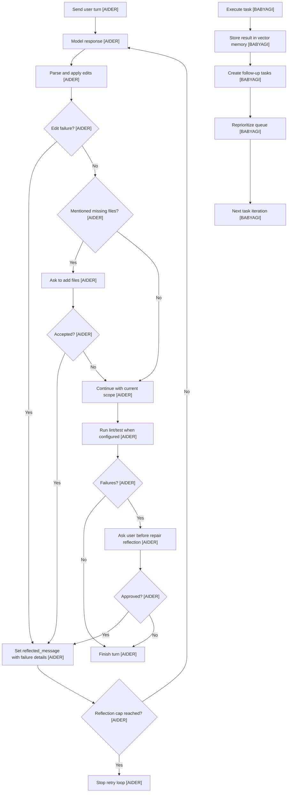

# Feedback Loops
> Module: 08_user_interaction | Status: Phase 1 Draft | Last Agent: Worker E

## 1. Overview

Feedback loops convert runtime outcomes into the next model-visible input. [AIDER] In Aider, the common retry primitive is `reflected_message`: malformed edits, file-scope changes, lint output, test output, and other repair prompts can all be routed back through the same `run_one()` loop. [AIDER] The loop is capped by `max_reflections = 3`, preventing unlimited self-repair. [AIDER]

Aider separates autonomous correction from user-approved correction. [AIDER] Edit parsing and application failures can become reflected model input as part of the coding loop, while lint and test failures require explicit user confirmation before Aider asks the model to repair them. [AIDER] Shell-command output is also gated before it is added back into chat. [AIDER]

BabyAGI has a feedback loop, but it is task-oriented rather than validation-oriented. [BABYAGI] A completed task result is stored in vector memory, then passed into task creation and prioritization prompts to reshape the queue. [BABYAGI] There is no lint/test validation, no patch failure reflection, no approval gate, and no retry state beyond the generated next tasks. [BABYAGI]

## 2. Blueprint Specification

| Capability | Phase 1 Blueprint | Source Pattern |
| :--- | :--- | :--- |
| Unified reflection channel | Represent repair input as a model-visible reflected message rather than hidden state. [AIDER] | `reflected_message` in the coder loop. [AIDER] |
| Reflection cap | Bound repeated self-repair attempts. [AIDER] | `max_reflections = 3`. [AIDER] |
| Edit failure feedback | Feed malformed edit output and unapplicable patches back into the model automatically. [AIDER] | Edit parser/apply failures. [AIDER] |
| File mention feedback | Ask to add missing mentioned files, then reflect the updated file set into a new pass. [AIDER] | `check_for_file_mentions()`. [AIDER] |
| Lint feedback gate | Convert lint failures into a repair prompt only after user approval. [AIDER] | `Attempt to fix lint errors?`. [AIDER] |
| Test feedback gate | Convert failing test output into a repair prompt only after user approval. [AIDER] | `Attempt to fix test errors?`. [AIDER] |
| Task-result feedback | Store execution output, create new tasks, reprioritize the queue, and execute the next task. [BABYAGI] | `execution_agent()` -> results storage -> `task_creation_agent()` -> `prioritization_agent()`. [BABYAGI] |

Feedback categories:

- Structural feedback: malformed edit blocks, failed hunk matches, ambiguous whole-file output, or blocked file targets. [AIDER]
- Context feedback: newly accepted files or changed editable/read-only scope. [AIDER]
- Operational feedback: lint errors, test failures, or shell output that the user chooses to add to chat. [AIDER]
- Goal feedback: completed task results that generate and reorder future work. [BABYAGI]

## 3. Logic Flow

1. A user turn enters `run_one()`, which resets per-message state and sends the message. [AIDER]
2. The model response is parsed and applied. [AIDER]
3. If parsing or application fails, Aider writes a reflected message describing the problem. [AIDER]
4. If the assistant mentions files outside chat, Aider asks whether to add them; accepted additions also become reflection input. [AIDER]
5. `run_one()` repeats while `reflected_message` exists and the reflection count remains under the cap. [AIDER]
6. After successful edits, Aider may run lint and test checks. [AIDER]
7. Lint or test failures become reflected repair prompts only if the user approves the repair attempt. [AIDER]
8. Shell-command output is added back to chat only if the user confirms. [AIDER]
9. In BabyAGI, the task result is always written to completed-result memory, then task creation and prioritization use that result to produce the next queue state. [BABYAGI]
10. BabyAGI does not verify the result before storing it and does not distinguish repair feedback from ordinary task generation. [BABYAGI]

## 4. Flowchart



## 5. Sequence Diagram

```mermaid
sequenceDiagram
    participant User
    participant Loop as "run_one Loop [AIDER]"
    participant Model as "LLM [AIDER]"
    participant Edit as "Edit/Apply Layer [AIDER]"
    participant Check as "Lint/Test/Shell Gates [AIDER]"

    User->>Loop: Submit request
    Loop->>Model: Send prompt
    Model-->>Loop: Response
    Loop->>Edit: Parse and apply edits
    alt Malformed or failed edit
        Edit-->>Loop: Failure details
        Loop->>Loop: Set reflected_message
        Loop->>Model: Retry with reflected failure
    else Edits applied
        Edit-->>Loop: Success
        Loop->>Check: Run configured checks
        alt Check failure
            Check-->>User: Ask whether to repair
            User-->>Check: Approve or decline
            Check-->>Loop: Reflected repair prompt when approved
            Loop->>Model: Retry when approved and under cap
        else Checks pass
            Loop-->>User: Final response
        end
    end
```

## 6. Variations & Trade-offs

| Variation | Strength | Cost or Risk |
| :--- | :--- | :--- |
| Unified reflected message [AIDER] | One retry mechanism handles malformed edits, context changes, and approved validation failures. [AIDER] | Requires careful tagging of feedback so the model understands the next attempt. [AIDER] |
| Reflection cap [AIDER] | Prevents endless loops after repeated failures. [AIDER] | A hard cap can stop before a repairable issue is solved. [AIDER] |
| User-gated lint/test repair [AIDER] | Keeps operational validation repair under human control. [AIDER] | Adds friction when users want fully automatic repair. [AIDER] |
| Automatic edit-failure reflection [AIDER] | Lets the model correct formatting or patch mistakes quickly. [AIDER] | Can spend extra model calls on parser-level issues. [AIDER] |
| Task-result feedback [BABYAGI] | Simple autonomous progress loop from execution result to new tasks. [BABYAGI] | No independent validation, no structured error class, and no repair-specific feedback state. [BABYAGI] |

## 7. Agent Attribution Table
| Agent | Contribution | Phase 1 Use |
| :--- | :--- | :--- |
| [AIDER] | Reflected-message retry primitive, reflection cap, edit-failure feedback, file-context feedback, and user-gated lint/test repair. | Primary source for human-in-the-loop feedback and repair design. |
| [BABYAGI] | Task-result feedback through memory, task creation, and prioritization. | Contrast pattern for goal-progress feedback without validation or tool repair. |
