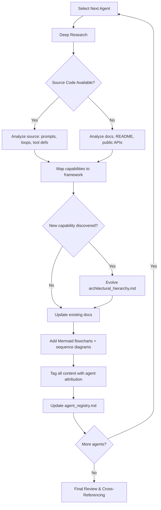

# Master AI Agent Blueprint — Implementation Plan

## Index of Contents

- [1. Goal](#1-goal)
- [2. Scope Boundaries](#2-scope-boundaries)
- [3. Reference Agents (from `references.md`)](#3-reference-agents-from-referencesmd)
- [4. Proposed Documentation Architecture](#4-proposed-documentation-architecture)
    - [4.1 Folder Structure](#41-folder-structure)
    - [4.2 File Standards](#42-file-standards)
- [5. Analysis Framework Evolution Strategy](#5-analysis-framework-evolution-strategy)
    - [5.1 Starting Framework](#51-starting-framework-baseline-from-ai-agent-feature-hierarchy-developmentmd)
    - [5.2 Anticipated Evolution](#52-anticipated-evolution)
- [6. Agent Analysis Order & Rationale](#6-agent-analysis-order--rationale)
- [7. Attribution and Tagging System](#7-attribution-and-tagging-system)
    - [7.1 Inline Tags](#71-inline-tags)
    - [7.2 Agent Attribution Table](#72-agent-attribution-table-per-section)
    - [7.3 Color-Coding Legend](#73-color-coding-legend-in-agent_registrymd)
- [8. Execution Workflow (Per Agent)](#8-execution-workflow-per-agent)
    - [8.1 Research Depth Per Agent](#81-research-depth-per-agent)
- [9. Estimated Effort & Phasing](#9-estimated-effort--phasing)
- [10. Verification Plan](#10-verification-plan)
- [Open Questions](#open-questions)

---

## 1. Goal

Produce a modular, technically deep documentation suite (`docs/`) that represents the **functional and technical super-set** of capabilities across 14 reference agents. The output will serve as a "Master Blueprint" for designing a next-generation AI agent, grounded in reverse-engineered implementation details rather than marketing abstractions.

---

## 2. Scope Boundaries

| In Scope | Out of Scope |
|---|---|
| Core agent loop logic, prompt orchestration | Installation, packaging, distribution |
| Tool-calling architecture & sandboxing | CI/CD pipelines of reference projects |
| Memory systems (working, episodic, semantic, procedural) | Cloud infrastructure / hosting details |
| Permission models & governance within the agent | IDE extension packaging / marketplace |
| Edit format strategies & code-modification flows | UI/UX chrome of host applications |
| Context management & token economics | End-user onboarding tutorials |
| Multi-agent orchestration patterns | Business models / pricing |
| MCP / plugin / extensibility protocols | |

---

## 3. Reference Agents (from `references.md`)

The reference set contains 14 agents organized by archetype:

| # | Agent | Archetype | Key Differentiators for Analysis |
|---|---|---|---|
| 1 | **Aider** | Terminal-native coding pair-programmer | Repo-map via tree-sitter, edit formats (diff/whole/udiff), git-native workflow, multi-model architect/editor pattern |
| 2 | **Claude Code** | Terminal-native agentic coder | Agentic loop with tool-use, CLAUDE.md memory, permission tiers, sub-agents, hooks system, MCP integration |
| 3 | **OpenAI Codex** | Sandboxed cloud agent | Full sandbox isolation (network-disabled by default), `codex-rs` Rust CLI, autonomy levels (suggest/auto-edit/full-auto) |
| 4 | **Cline** | IDE-embedded autonomous agent | Human-in-the-loop per-action, browser automation (via Puppeteer), MCP client, file create/edit/command execution |
| 5 | **Roo Code** | IDE-embedded multi-persona agent | Mode system (Code/Architect/Debug/Ask/Orchestrator), custom modes, Boomerang orchestration pattern, MCP support |
| 6 | **Kilo Code** | IDE-embedded agentic platform | Task-based workflows, checkpoint/diff system, file-level permissions, OpenRouter-first multi-provider |
| 7 | **AutoGPT** | Autonomous goal-seeking agent | Goal decomposition → task queue, plugin ecosystem, long-running autonomous loops, memory via vector stores |
| 8 | **BabyAGI** | Minimal task-driven agent plus current function framework | Classic archive: task creation → prioritization → execution loop, vector DB context; current repo: functionz database, triggers, dashboard, self-building function packs |
| 9 | **OpenCode** | Terminal-based TUI coding agent | Client/server architecture, built-in agent personas (build/plan), multi-provider support, plugin/extension ecosystem |
| 10 | **Pi Agent** | Modular coding agent runtime | Monorepo architecture (core/CLI/AI/TUI), tool-calling runtime, unified multi-LLM API, terminal UI |
| 11 | **Continue** | IDE coding assistant framework | AI checks in CI, source-controlled rules, provider-agnostic, context providers, slash commands |
| 12 | **Hermes Agent** | Self-improving agent framework | "Agent that grows with you", Nous Research model-centric, tool-use with function calling |
| 13 | **OpenClaw** | Cross-platform personal assistant | Multi-OS agent, platform-agnostic interface, broad tool surface |
| 14 | **Zed** | Editor with integrated AI agent | Native editor-embedded agent, inline assist, terminal integration, multi-LLM |

> [!NOTE]
> Zed is included as a 14th reference despite being primarily an editor — its agent integration pattern provides unique insights into editor-native AI architecture.

---

## 4. Proposed Documentation Architecture

### 4.1 Folder Structure

```
docs/
├── 00_meta/
│   ├── architectural_hierarchy.md        # The evolving analysis framework (versioned)
│   ├── agent_registry.md                 # Catalog of all analyzed agents + key metadata
│   └── glossary.md                       # Standardized terminology
│
├── 01_core_loop/
│   ├── agentic_loop.md                   # The fundamental perceive → think → act → observe cycle
│   ├── prompt_orchestration.md           # System prompt construction, message assembly, context injection
│   └── turn_lifecycle.md                 # Single-turn anatomy: input → processing → tool-calls → response
│
├── 02_cognition/
│   ├── task_decomposition.md             # Goal → sub-task breakdown strategies (DAG, queue, recursive)
│   ├── planning_strategies.md            # Plan-then-execute vs. reactive; architect/editor patterns
│   ├── reasoning_patterns.md             # CoT, branching logic, self-critique, reflection loops
│   └── model_routing.md                  # Multi-model strategies (architect + editor, cheap + expensive)
│
├── 03_context_engine/
│   ├── context_assembly.md               # How the prompt window is populated and prioritized
│   ├── repo_map_and_indexing.md          # Codebase understanding: tree-sitter, embeddings, search
│   ├── token_economics.md               # Context window management, truncation, summarization
│   └── retrieval_strategies.md           # RAG, semantic search, file-content retrieval
│
├── 04_memory/
│   ├── working_memory.md                 # Conversation buffer, in-session state
│   ├── persistent_memory.md              # Cross-session knowledge (CLAUDE.md, .aider.conf, conventions)
│   ├── episodic_memory.md                # Event logs, conversation history, execution traces
│   └── semantic_memory.md                # Vector-embedded knowledge, skill libraries
│
├── 05_action_and_tools/
│   ├── tool_architecture.md              # Tool definition, registration, invocation protocol
│   ├── code_modification.md             # Edit formats: whole-file, diff, search-replace, udiff
│   ├── command_execution.md              # Shell/terminal command execution patterns
│   ├── browser_interaction.md            # Headless browser, Puppeteer, web interaction
│   └── extensibility.md                  # MCP, plugins, custom tools, skill libraries
│
├── 06_orchestration/
│   ├── multi_agent_patterns.md           # Sub-agents, delegation, Boomerang, manager/worker
│   ├── workflow_modes.md                 # Mode systems (Code/Architect/Debug), persona switching
│   └── task_lifecycle.md                 # Task queuing, prioritization, checkpointing, resume
│
├── 07_permissions_and_governance/
│   ├── permission_model.md               # Autonomy levels, approval gates, allow/deny rules
│   ├── sandboxing.md                     # Execution isolation, network policies, filesystem boundaries
│   ├── safety_guardrails.md              # Input/output validation, constitutional AI, circuit breakers
│   └── audit_and_observability.md        # Logging, telemetry, execution traces, cost tracking
│
└── 08_user_interaction/
    ├── input_processing.md               # Command parsing, slash commands, @-mentions, file references
    ├── output_formatting.md              # Streaming, markdown rendering, diff display, progress indicators
    └── feedback_loops.md                 # Human-in-the-loop patterns, approval UX, undo/rollback
```

### 4.2 File Standards

Every document in `docs/01_*` through `docs/08_*` **must** contain:

1. **Overview** — What this capability area is and why it matters.
2. **Blueprint Specification** — The agnostic, generalized technical specification (the "super-set").
3. **Logic Flow** — Step-by-step algorithmic description of the primary flow.
4. **Mermaid Flowchart** — A flowchart diagram showing the decision/execution flow.
5. **Mermaid Sequence Diagram** — A sequence diagram showing data and control flow between components.
6. **Agent Attribution Table** — A table mapping which real-world agent contributed which specific pattern or detail to this section.
7. **Variations & Trade-offs** — Where agents diverge in implementation strategy.

---

## 5. Analysis Framework Evolution Strategy

### 5.1 Starting Framework (Baseline from `AI Agent Feature Hierarchy Development.md`)

The existing 7-level hierarchy will be the starting baseline:

| Level | Original Name | Initial Mapping to `docs/` |
|---|---|---|
| L1 | Macro-Architecture & Ecosystem Autonomy | `06_orchestration/`, `07_permissions_and_governance/` |
| L2 | Sensory Perception & Multimodal Processing | `03_context_engine/` |
| L3 | Core Cognitive Engine | `01_core_loop/`, `02_cognition/` |
| L4 | Metacognition & Self-Regulation | `02_cognition/reasoning_patterns.md` |
| L5 | Memory Architecture & Temporal Persistence | `04_memory/` |
| L6 | Action Orchestration & Executable Skill Libraries | `05_action_and_tools/` |
| L7 | Governance, Guardrails & Alignment | `07_permissions_and_governance/` |

### 5.2 Anticipated Evolution

Based on initial research, the baseline framework has significant gaps for coding-agent architectures. Expected refinements include:

| Gap | Proposed Addition | Rationale |
|---|---|---|
| No concept of "Context Engine" as distinct from perception | Add **Context Assembly** as a first-class layer | Coding agents spend enormous effort on context window curation (repo-maps, file retrieval, token budgeting). This is not "perception" in the multimodal sense. |
| Edit formats are not represented | Add **Code Modification Strategies** under Action | The diff/whole-file/search-replace architecture is a massive differentiator across agents. |
| No treatment of user interaction patterns | Add **User Interaction** layer | Slash commands, approval UX, streaming output, @-mentions are core to agent usability. |
| Multi-agent is only theoretical | Expand with **concrete orchestration patterns** | Roo Code's Boomerang, Claude Code's sub-agents, AutoGPT's plugin workers are real implementations. |
| Metacognition is overly abstract | Ground in **self-correction loops + error recovery** | Real agents implement retry-with-lint-feedback, not TRAP frameworks. |

The `architectural_hierarchy.md` file will be versioned explicitly (v1, v2, v3...) within the document to track evolution.

---

## 6. Agent Analysis Order & Rationale

The analysis order is designed to build complexity progressively, starting with the most architecturally transparent agents:

| Phase | Agents | Rationale |
|---|---|---|
| **Phase 1 — Foundation** | **Aider**, **BabyAGI** | Aider establishes coding-agent context/edit/git patterns. BabyAGI classic establishes the minimal autonomous task loop; current BabyAGI contributes a later functionz/self-building delta. |
| **Phase 2 — Claude Code** | **Claude Code** | Adds tool-use loop, memory, hooks, sub-agents, MCP, and permissions. |
| **Phase 3 — OpenAI Codex** | **OpenAI Codex** | Adds sandbox-first architecture and autonomy levels. |
| **Phase 4 — IDE-Embedded** | **Cline**, **Roo Code** | Reveals IDE integration, browser tools, human approval gates, mode systems, and Boomerang orchestration. |
| **Phase 5 — Kilo Code + OpenCode** | **Kilo Code**, **OpenCode** | Adds checkpoint/diff workflows, task-based IDE agent patterns, TUI agent architecture, and client/server model. |
| **Phase 6 — Autonomous** | **AutoGPT**, **Pi Agent** | Adds long-running goal decomposition and modular agent runtimes. |
| **Phase 7 — Specialist** | **Continue**, **Hermes Agent**, **OpenClaw**, **Zed** | Adds CI integration, model-specific tuning, cross-platform patterns, and editor-native AI coupling. |

---

## 7. Attribution and Tagging System

To track which agent contributed what, every section will use a consistent tagging system:

### 7.1 Inline Tags

```markdown
The agent constructs a repo-map using tree-sitter to extract function/class signatures 
across the entire repository. `[AIDER]` This map is ranked by PageRank-style relevance 
scoring based on call-graph density. `[AIDER]`
```

### 7.2 Agent Attribution Table (per section)

Each major section will conclude with a table:

| Pattern / Detail | Contributing Agent(s) | Notes |
|---|---|---|
| Tree-sitter based repo-map | Aider | PageRank relevance scoring |
| Glob-pattern file search | Claude Code, Cline, Roo Code | Shared pattern across IDE agents |
| Network-disabled sandbox | OpenAI Codex | Unique strict isolation model |

### 7.3 Color-Coding Legend (in `agent_registry.md`)

Each agent will be assigned a short tag used throughout the documentation:

| Tag | Agent |
|---|---|
| `[AIDER]` | Aider |
| `[CLAUDE]` | Claude Code |
| `[CODEX]` | OpenAI Codex |
| `[CLINE]` | Cline |
| `[ROO]` | Roo Code |
| `[KILO]` | Kilo Code |
| `[AUTOGPT]` | AutoGPT |
| `[BABYAGI]` | BabyAGI |
| `[OPENCODE]` | OpenCode |
| `[PI]` | Pi Agent |
| `[CONTINUE]` | Continue |
| `[HERMES]` | Hermes Agent |
| `[OPENCLAW]` | OpenClaw |
| `[ZED]` | Zed |

---

## 8. Execution Workflow (Per Agent)

For each agent in the analysis order, the following steps will be executed:



### 8.1 Research Depth Per Agent

For each agent, I will:

1. **Read the GitHub README** — Already completed for all 13 agents.
2. **Read official documentation** — Architecture docs, API references, configuration guides.
3. **Analyze source code** (where open-source) — Focus on:
   - System prompts / prompt templates
   - Main agent loop implementation
   - Tool definition and invocation code
   - Memory/state management code
   - Permission/guardrail logic
4. **Read blog posts & technical write-ups** — Architecture decisions, design rationale.

---

## 9. Estimated Effort & Phasing

| Phase | Agents | Estimated Docs Created/Updated | Key Outputs |
|---|---|---|---|
| Phase 1 | Aider, BabyAGI | ~15 document updates | Baseline framework v1, coding edit loop, minimal task loop |
| Phase 2 | Claude Code | ~10 major updates + framework v2 | Sub-agent patterns, hooks, MCP, permissions |
| Phase 3 | Codex | ~6 major updates + framework v3 | Sandbox architecture, autonomy levels |
| Phase 4 | Cline, Roo Code | ~8 major updates + framework v4 | IDE integration patterns, mode systems, browser tools |
| Phase 5 | Kilo Code, OpenCode | ~8 major updates + framework v5 | Checkpoint/diff workflows, task lifecycle patterns, TUI agent architecture |
| Phase 6 | AutoGPT, Pi Agent | ~6 major updates + framework v6 | Autonomous loops, modular runtimes, goal decomposition |
| Phase 7 | Continue, Hermes, OpenClaw, Zed | ~5 updates + framework v_FINAL | CI integration, model routing, editor-native patterns |
| Finalization | — | Cross-reference review | Final `architectural_hierarchy.md` v_FINAL, complete attribution |

> [!IMPORTANT]
> This is a substantial exercise. I recommend executing it **phase by phase**, with a brief checkpoint after each phase where you can review intermediate outputs before I proceed.

---

## 10. Verification Plan

### Automated Checks
- All Mermaid diagrams will be syntactically valid (testable by rendering).
- Every document will be verified to contain all 7 required sections (Overview through Variations).
- Attribution tags will be cross-referenced against `agent_registry.md` for completeness.

### Manual Verification
- After each phase, I will produce a summary artifact showing what was added/changed.
- You will review the evolving `architectural_hierarchy.md` at each version boundary.
- Final cross-referencing pass will ensure no orphaned sections or missing attributions.

---

## Open Questions

> [!IMPORTANT]
> **Q1: Analysis Depth vs. Breadth Trade-off**
> Given 13 agents, should I prioritize **deep source-code analysis** for the top 4-5 most architecturally rich agents (Aider, Claude Code, Codex, Cline, AutoGPT) and do **documentation-level analysis** for the rest? Or do you want uniform depth across all 13?

> [!IMPORTANT]
> **Q2: Phase Checkpoints**
> Should I pause after each phase for your review, or should I run through all 5 phases continuously and present the complete output?

> [!IMPORTANT]
> **Q3: Framework Baseline**
> The existing 7-level hierarchy in `AI Agent Feature Hierarchy Development.md` is heavily oriented toward general-purpose autonomous agents (multimodal perception, embodied agents, Voyager/Minecraft). The reference agents are overwhelmingly **coding agents**. Should I:
> - (a) Preserve the general framework and add coding-specific extensions, or
> - (b) Restructure the framework to be coding-agent-centric (given the reference set), noting where general-agent concepts would extend it?

> [!IMPORTANT]
> **Q4: Zed Inclusion**
> Zed's README links to general editor docs, not a standalone agent. Its AI features are deeply integrated into the editor. Should I include it as a full analysis target or reference it selectively where relevant?
