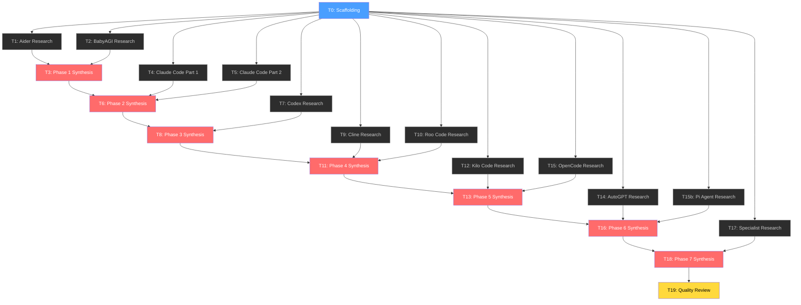

# Master AI Agent Blueprint — Task List

> [!NOTE]
> Each task is designed to be **self-contained** and executable by a fresh agent with near-empty context. Tasks specify explicit **Inputs** (files to read for context), **Outputs** (files to create/update), and **Acceptance Criteria**. Dependencies are noted where a task requires outputs from a prior task.

---

## Conventions

- **`INPUTS:`** — Files the agent MUST read before starting work. These provide all necessary context.
- **`OUTPUTS:`** — Files the agent must create or update. These are the deliverables.
- **`DEPENDS ON:`** — Prior tasks whose outputs are required inputs.
- **`RESEARCH SOURCES:`** — URLs or repositories the agent should consult.
- **`ACCEPTANCE CRITERIA:`** — The "definition of done" for the task.

---

## Phase 0: Scaffolding

### Task 0: Create Folder Structure and Foundational Meta Files

- `[x]` **Status: Completed**

**Objective:** Create the complete `docs/` folder tree, and populate the three meta-files (`architectural_hierarchy.md` v0, `agent_registry.md`, `glossary.md`) with initial content. Create stub files for every document in the tree with a standard template header.

**INPUTS:**
- `AI Agent Feature Hierarchy Development.md` (read the 7-level framework to seed `architectural_hierarchy.md` v0)
- `references.md` (read the agent list to seed `agent_registry.md`)
- Folder structure to create:
  ```
  docs/
  ├── _research/                          # Intermediate research reports (not final output)
  ├── 00_meta/                            # architectural_hierarchy.md, agent_registry.md, glossary.md
  ├── 01_core_loop/                       # agentic_loop.md, prompt_orchestration.md, turn_lifecycle.md
  ├── 02_cognition/                       # task_decomposition.md, planning_strategies.md, reasoning_patterns.md, model_routing.md
  ├── 03_context_engine/                  # context_assembly.md, repo_map_and_indexing.md, token_economics.md, retrieval_strategies.md
  ├── 04_memory/                          # working_memory.md, persistent_memory.md, episodic_memory.md, semantic_memory.md
  ├── 05_action_and_tools/                # tool_architecture.md, code_modification.md, command_execution.md, browser_interaction.md, extensibility.md
  ├── 06_orchestration/                   # multi_agent_patterns.md, workflow_modes.md, task_lifecycle.md
  ├── 07_permissions_and_governance/       # permission_model.md, sandboxing.md, safety_guardrails.md, audit_and_observability.md
  └── 08_user_interaction/                # input_processing.md, output_formatting.md, feedback_loops.md
  ```

**OUTPUTS:**
- All directories above, created under `/Users/deepg/Desktop/agent/docs/`
- `docs/00_meta/architectural_hierarchy.md` — v0 seeded from the 7-level framework mapped to the 8-module structure
- `docs/00_meta/agent_registry.md` — Table of all 13 agents with columns: Tag, Name, URL, Archetype, Analysis Phase, Status
- `docs/00_meta/glossary.md` — Initial glossary of ~15 key terms (agentic loop, tool-call, MCP, repo-map, context window, etc.)
- All 30 stub `.md` files in `01_*` through `08_*`, each containing a standard template:
  ```markdown
  # [Title]
  > Module: [parent folder name] | Status: Stub | Last Agent: None
  ## 1. Overview
  ## 2. Blueprint Specification
  ## 3. Logic Flow
  ## 4. Flowchart
  ## 5. Sequence Diagram
  ## 6. Agent Attribution Table
  ## 7. Variations & Trade-offs
  ```

**ACCEPTANCE CRITERIA:**
- [x] All 10 directories exist under `docs/` (including `_research/`)
- [x] All 33 files exist (3 meta + 30 module docs)
- [x] `architectural_hierarchy.md` contains v0 with 7 original levels mapped to the 8 `docs/` modules
- [x] `agent_registry.md` contains all 13 agents with correct tags
- [x] Every stub file contains the 7-section template header

---

## Phase 1: Foundation — Aider + BabyAGI

### Task 1: Aider — Research Core Loop, Context Engine & Edit Formats

- `[x]` **Status: Completed**
- **DEPENDS ON:** Task 0

**Objective:** Perform a deep-dive into Aider's architecture. Research its core agentic loop, repo-map system (tree-sitter + PageRank), edit format strategies (whole/diff/udiff/search-replace), git-native workflow, and architect/editor multi-model pattern. Produce a structured research report as an intermediate artifact.

**INPUTS:**
- `docs/00_meta/agent_registry.md` (for the `[AIDER]` tag convention)
- `docs/00_meta/architectural_hierarchy.md` v0 (to understand the framework being populated)

**RESEARCH SOURCES:**
- **Local Repository:** `./aider/` (Primary: core logic in `aider/coders/`, `aider/repomap.py`, `aider/commands.py`)
- **Documentation:** https://aider.chat/docs/ (Secondary: for high-level concepts and repo-map theory)

**OUTPUTS:**
- `docs/_research/aider_research.md` — A structured research report containing:
  1. **Core Loop**: How Aider processes a user request end-to-end (message → LLM → edit extraction → git commit)
  2. **Repo-Map**: Tree-sitter parsing → tag extraction → PageRank ranking → context injection. Include the exact flow.
  3. **Edit Formats**: Detailed breakdown of each format (whole-file, diff, udiff, search-replace blocks), when each is selected, and why.
  4. **Architect/Editor Pattern**: How the two-model flow works (architect plans, editor executes).
  5. **Git Integration**: Auto-commit, dirty-file handling, undo mechanism.
  6. **Linting & Auto-fix**: How lint errors feed back into the loop.
  7. **Context Assembly**: How Aider decides what files/content to include in the prompt.
  
  Each section must include enough detail for another agent to later write flowcharts and sequence diagrams from it.

**ACCEPTANCE CRITERIA:**
- [ ] Research report covers all 7 sections listed above
- [ ] Each section describes step-by-step logic (not marketing-level descriptions)
- [ ] Edit format section includes concrete examples of each format's prompt structure
- [ ] Repo-map section explains the tree-sitter → tags → ranking pipeline
- [ ] Report explicitly notes unique/novel patterns not seen in typical agent designs

---

### Task 2: BabyAGI — Research Full Architecture

- `[x]` **Status: Completed**
- **DEPENDS ON:** Task 0

**Objective:** Perform a complete architectural analysis of BabyAGI. As the simplest agent in the set, this establishes the minimal viable agent loop that all other agents extend.

**INPUTS:**
- `docs/00_meta/agent_registry.md`
- `docs/00_meta/architectural_hierarchy.md` v0

**RESEARCH SOURCES:**
- **Local Repository:** `./babyagi/` (Primary: `babyagi.py` and core task logic)
- **Technical Write-ups:** BabyAGI blog posts (Secondary: for early-stage design intent)

**OUTPUTS:**
- `docs/_research/babyagi_research.md` — A structured research report containing:
  1. **Core Loop**: The task_creation → task_prioritization → execution_agent cycle.
  2. **Task Queue**: How tasks are stored, created, and prioritized.
  3. **Memory**: How the vector store (Pinecone/Chroma) is used for context enrichment.
  4. **LLM Invocation**: How prompts are constructed for each of the three sub-functions.
  5. **Simplicity Analysis**: What is intentionally absent (no tools, no edit formats, no permissions) — this defines the "floor" of the capability spectrum.

**ACCEPTANCE CRITERIA:**
- [ ] Report covers all 5 sections
- [ ] Core loop is described step-by-step with exact data flow between the three functions
- [ ] Report includes the actual prompt templates used for task creation, prioritization, and execution
- [ ] "Simplicity Analysis" section explicitly lists what is missing compared to the framework

---

### Task 3: Phase 1 Synthesis — Populate Docs from Aider + BabyAGI Research

- `[x]` **Status: Completed**
- **DEPENDS ON:** Task 1, Task 2

**Objective:** Using the two research reports as input, populate the `docs/` module files with initial content. Create the first real version of every document that Aider or BabyAGI contributes to. Evolve `architectural_hierarchy.md` to v1. All content must include `[AIDER]` and `[BABYAGI]` attribution tags.

**INPUTS:**
- `docs/_research/aider_research.md` (Task 1 output)
- `docs/_research/babyagi_research.md` (Task 2 output)
- `docs/00_meta/architectural_hierarchy.md` v0
- All stub files in `docs/01_*` through `docs/08_*`

**OUTPUTS (create/update these files):**
- `docs/01_core_loop/agentic_loop.md` — Populate with Aider's edit-loop and BabyAGI's task-loop as two concrete patterns. Include Mermaid flowcharts for both.
- `docs/01_core_loop/prompt_orchestration.md` — How Aider assembles its prompts (system prompt + repo-map + file contents + user message).
- `docs/01_core_loop/turn_lifecycle.md` — Single-turn anatomy based on Aider's flow.
- `docs/02_cognition/task_decomposition.md` — BabyAGI's task creation + prioritization as the baseline pattern.
- `docs/02_cognition/planning_strategies.md` — Aider's architect/editor pattern.
- `docs/02_cognition/model_routing.md` — Aider's multi-model strategy (architect model + editor model).
- `docs/03_context_engine/repo_map_and_indexing.md` — Aider's tree-sitter + PageRank repo-map (this should be one of the richest documents).
- `docs/03_context_engine/context_assembly.md` — How Aider decides what goes in the prompt window.
- `docs/03_context_engine/token_economics.md` — Aider's context window management strategies.
- `docs/03_context_engine/retrieval_strategies.md` — Aider's repo-map as a ranked retrieval strategy (tree-sitter tags → PageRank → top-k injection), BabyAGI's vector-similarity retrieval as a contrasting pattern.
- `docs/04_memory/working_memory.md` — Aider's chat history buffer, BabyAGI's task queue.
- `docs/04_memory/semantic_memory.md` — BabyAGI's vector store usage.
- `docs/05_action_and_tools/code_modification.md` — Aider's 4 edit formats with flowcharts.
- `docs/08_user_interaction/input_processing.md` — Aider's slash commands (/add, /drop, /run, etc.).
- `docs/08_user_interaction/feedback_loops.md` — Aider's lint-feedback and auto-fix loop.
- `docs/00_meta/architectural_hierarchy.md` — Evolve to **v1**: document gaps discovered and refinements made.

**ACCEPTANCE CRITERIA:**
- [ ] Every file listed above is populated beyond the stub template
- [ ] Each populated file contains at least one Mermaid flowchart and one sequence diagram
- [ ] All agent-specific content carries `[AIDER]` or `[BABYAGI]` inline tags
- [ ] Each file ends with an Agent Attribution Table
- [ ] `architectural_hierarchy.md` v1 documents what changed from v0 and why
- [ ] Files NOT relevant to Aider/BabyAGI remain as stubs (don't invent content)

---

## Phase 2: Claude Code

### Task 4: Claude Code — Research Core Loop, Tools & Permissions

- `[x]` **Status: Completed**
- **DEPENDS ON:** Task 0

**Objective:** Deep-dive into Claude Code's architecture focusing on its agentic loop, tool system, permission model, and hooks system. Use official documentation and source code.

**INPUTS:**
- `docs/00_meta/agent_registry.md`

**RESEARCH SOURCES:**
- **Local Repository:** `./claude-code/` (Primary: system prompts, tool definitions in `src/`, and the main agent loop)
- **Documentation:** https://code.claude.com/docs/ (Secondary: for permission and hook specifications)

**OUTPUTS:**
- `docs/_research/claude_code_research_part1.md` — Structured report:
  1. **Agentic Loop**: The full turn lifecycle — user input → system prompt assembly → LLM call → tool-use response → tool execution → result injection → next LLM call → completion.
  2. **Tool System**: Complete catalog of built-in tools (Read, Write, Edit, Bash, Glob, Grep, etc.), their signatures, how tool-calls are formatted and parsed.
  3. **Permission Model**: The 3 modes (default, permissive, auto), allow/deny rules, `settings.json` structure, how permissions cascade (project → user → enterprise).
  4. **Hooks System**: Pre/post tool-call hooks, notification hooks, how they intercept the loop. JSON input/output schemas.
  5. **Autonomy Levels**: How `--dangerously-skip-permissions` and managed policies work.

**ACCEPTANCE CRITERIA:**
- [x] Agentic loop section describes the full cycle with data flowing between components
- [x] Tool system section lists all known tools with their parameters
- [x] Permission model section covers the cascading priority logic
- [x] Hooks section includes the lifecycle events and JSON schemas

> **Source-of-truth note:** Claude Code is closed-source; analysis was performed against the open-source reimplementation **claw-code** at `/Users/deepg/Desktop/agent/claw-code/` (HEAD `a389f8d`). The harness is in `rust/crates/`, not the Python `src/` scaffold. Significant divergences from upstream Claude Code documentation are flagged inline in the report (3 of 9 hook events implemented; settings root `.claw/` not `.claude/`; default mode `DangerFullAccess`; no managed-policy paths; no hook matcher syntax). Synthesis (Task 6) should treat the report as describing claw-code's reality and supplement with upstream docs where the blueprint requires patterns claw-code does not implement.

---

### Task 5: Claude Code — Research Memory, Sub-Agents, MCP & Extensibility

- `[x]` **Status: Completed**
- **DEPENDS ON:** Task 0

**Objective:** Deep-dive into Claude Code's memory architecture, sub-agent system, MCP integration, and extensibility mechanisms.

**INPUTS:**
- `docs/00_meta/agent_registry.md`

**RESEARCH SOURCES:**
- **Local Repository:** `./claude-code/` (Primary: MCP client code, memory handler, and sub-agent spawning logic)
- **Technical Specs:** https://modelcontextprotocol.io (Secondary: for protocol-specific details)

**OUTPUTS:**
- `docs/_research/claude_code_research_part2.md` — Structured report:
  1. **Memory System**: CLAUDE.md files (project, user, enterprise levels), auto-memory (`/memory` command), how memories are loaded and prioritized in the system prompt.
  2. **Sub-Agent Architecture**: How sub-agents (Task, Browser, etc.) are spawned, their reduced tool sets, context isolation, result aggregation.
  3. **MCP Integration**: How MCP servers are configured, tool discovery, how MCP tools appear alongside native tools.
  4. **Context Window Management**: How Claude Code manages token limits, message truncation/summarization strategies.
  5. **Slash Commands**: `/init`, `/memory`, `/bug`, `/compact`, `/clear`, custom commands — how they're parsed and executed.

**ACCEPTANCE CRITERIA:**
- [x] Memory section covers all memory file locations and loading precedence
- [x] Sub-agent section describes the spawning mechanism and context isolation boundary
- [x] MCP section explains the protocol handshake and tool registration flow
- [x] Context window section describes truncation/compaction strategies

> **Source-of-truth note (Part 2):** Same claw-code clone (HEAD `a389f8d`). Additional divergences from upstream Claude Code, flagged inline in the report — for the synthesis agent (Task 6) to fill from upstream docs where the blueprint requires patterns claw-code does not implement: (a) memory discovery walks cwd ancestry only — no user-home `~/.claude/CLAUDE.md`, no enterprise/managed paths, no `@include` directives; (b) `/memory` is read-only — no auto-write-back; (c) sub-agent surface is split into three distinct primitives — `Agent` (real sub-runtime spawn in a thread), `TaskCreate` (in-memory bookkeeping only), `WorkerCreate` (state machine over an externally-spawned process). No `Browser` sub-agent; (d) MCP: only stdio transport actually connects — `sse`/`http`/`ws`/`sdk`/`claudeai-proxy` parse but are routed to `unsupported_servers`; (e) Context window: no `cache_control` / prompt-caching breakpoints anywhere; token estimation is a `len()/4+1` heuristic, not a real tokenizer; (f) Slash commands: 87 specs, ~30 fully implemented; `/bug` is absent (closest: `/bughunter`); custom commands surface as skills under `.claw/commands/` (legacy `.claude/commands/` also walked), not as a separate slash-command registry.

---

### Task 6: Phase 2 Synthesis — Integrate Claude Code into Docs

- `[x]` **Status: Completed**
- **DEPENDS ON:** Task 3, Task 4, Task 5

**Objective:** Using the two Claude Code research reports, update all relevant `docs/` module files. Add Claude Code patterns alongside existing Aider/BabyAGI content. Evolve `architectural_hierarchy.md` to v2.

**INPUTS:**
- `docs/_research/claude_code_research_part1.md` (Task 4)
- `docs/_research/claude_code_research_part2.md` (Task 5)
- ALL existing files in `docs/01_*` through `docs/08_*` (current state from Task 3)
- `docs/00_meta/architectural_hierarchy.md` v1

**OUTPUTS (update — add to existing, don't replace):**
- `docs/01_core_loop/agentic_loop.md` — Add Claude Code's tool-use loop as a third pattern.
- `docs/01_core_loop/prompt_orchestration.md` — Add Claude Code's system prompt assembly (CLAUDE.md injection, tool definitions, permission context).
- `docs/01_core_loop/turn_lifecycle.md` — Add Claude Code's multi-tool-call turn anatomy.
- `docs/02_cognition/reasoning_patterns.md` — Populate with Claude Code's extended thinking and self-correction patterns.
- `docs/04_memory/persistent_memory.md` — Populate with CLAUDE.md architecture (was a stub).
- `docs/05_action_and_tools/tool_architecture.md` — Populate with Claude Code's tool definition and invocation protocol.
- `docs/05_action_and_tools/command_execution.md` — Populate with Claude Code's Bash tool.
- `docs/05_action_and_tools/extensibility.md` — Populate with MCP integration architecture.
- `docs/06_orchestration/multi_agent_patterns.md` — Populate with Claude Code's sub-agent pattern.
- `docs/07_permissions_and_governance/permission_model.md` — Populate with Claude Code's 3-mode system.
- `docs/07_permissions_and_governance/audit_and_observability.md` — Populate with Claude Code's hooks system (pre/post tool-call lifecycle events, notification hooks, JSON input/output schemas) as the primary observability pattern (was a stub).
- `docs/08_user_interaction/input_processing.md` — Add Claude Code's slash commands alongside Aider's.
- `docs/00_meta/architectural_hierarchy.md` — Evolve to **v2**.

**ACCEPTANCE CRITERIA:**
- [ ] All files above are updated with new content alongside existing Phase 1 content
- [ ] New content carries `[CLAUDE]` attribution tags
- [ ] New Mermaid diagrams added where Claude Code introduces new flows
- [ ] `multi_agent_patterns.md` includes sub-agent spawning sequence diagram
- [ ] `architectural_hierarchy.md` v2 documents changes from v1

---

## Phase 3: OpenAI Codex

### Task 7: OpenAI Codex — Research Full Architecture

- `[x]` **Status: Completed**
- **DEPENDS ON:** Task 0

**Objective:** Analyze OpenAI Codex CLI's architecture with focus on its unique sandbox-first approach, the `codex-rs` Rust CLI, and autonomy level system.

**INPUTS:**
- `docs/00_meta/agent_registry.md`

**RESEARCH SOURCES:**
- **Local Repository:** `./codex/` (Primary: focus on `codex-rs/` Rust source, sandboxing, and autonomy level implementation)
- **Official Docs:** OpenAI Codex technical papers and blog posts (Secondary)

**OUTPUTS:**
- `docs/_research/codex_research.md` — Structured report:
  1. **Core Architecture**: The `codex-rs` Rust CLI structure, how it orchestrates the agent loop.
  2. **Sandbox Model**: Network-disabled-by-default, filesystem isolation, how the sandbox is configured and enforced.
  3. **Autonomy Levels**: `suggest` (read-only), `auto-edit` (auto-apply file changes), `full-auto` (auto-apply + run commands). How each level gates tool execution.
  4. **Tool System**: What tools/actions are available (file read/write, shell commands, etc.).
  5. **Context Management**: How Codex handles context within the sandboxed environment.

**ACCEPTANCE CRITERIA:**
- [ ] Sandbox architecture is described at implementation level (not just "it's sandboxed")
- [ ] Autonomy levels section shows exactly which operations each level permits/blocks
- [ ] Report contrasts Codex's approach with what's already documented from Aider/Claude Code

---

### Task 8: Phase 3 Synthesis — Integrate Codex into Docs

- `[x]` **Status: Completed**
- **DEPENDS ON:** Task 6, Task 7

**Objective:** Using the Codex research report, update relevant `docs/` module files. Codex's primary contributions are the sandbox architecture and autonomy levels. Evolve `architectural_hierarchy.md` to v3.

**INPUTS:**
- `docs/_research/codex_research.md` (Task 7)
- ALL existing files in `docs/01_*` through `docs/08_*` (current state from Task 6)
- `docs/00_meta/architectural_hierarchy.md` v2

**OUTPUTS (update — add to existing, don't replace):**
- `docs/01_core_loop/agentic_loop.md` — Add Codex's sandbox-constrained loop as a fourth pattern.
- `docs/05_action_and_tools/command_execution.md` — Add Codex's sandboxed command execution alongside Claude Code's Bash tool.
- `docs/07_permissions_and_governance/permission_model.md` — Add Codex's 3-tier autonomy levels alongside Claude Code's 3-mode system.
- `docs/07_permissions_and_governance/sandboxing.md` — Populate with Codex's sandbox-first architecture (was a stub; this should be one of the most detailed documents as it's Codex's primary contribution).
- `docs/00_meta/architectural_hierarchy.md` — Evolve to **v3** if warranted.

**ACCEPTANCE CRITERIA:**
- [ ] All files above updated with `[CODEX]` tagged content
- [ ] `sandboxing.md` is richly detailed — Codex's key contribution to the blueprint
- [ ] `permission_model.md` now has two distinct systems compared side-by-side (Claude Code + Codex)
- [ ] `architectural_hierarchy.md` v3 reflects any framework changes

---

## Phase 4: Cline + Roo Code

### Task 9: Cline — Research Full Architecture

- `[ ]` **Status: Not Started**
- **DEPENDS ON:** Task 0

**Objective:** Analyze Cline's architecture — the original IDE-embedded autonomous coding agent. Focus on its human-in-the-loop per-action approval model, browser automation, MCP client, and tool system.

**INPUTS:**
- `docs/00_meta/agent_registry.md`

**RESEARCH SOURCES:**
- **Local Repository:** `./cline/` (Primary: `src/core/` and `src/api/` for tool definitions and browser automation)
- **Integration Docs:** Cline README and community documentation (Secondary)

**OUTPUTS:**
- `docs/_research/cline_research.md` — Structured report:
  1. **Core Loop**: How Cline processes a request in the IDE (message → LLM → tool proposal → human approval → execution → result feedback).
  2. **Human-in-the-Loop Model**: The per-action approval UX — what gets shown to the user, how approval/rejection feeds back.
  3. **Tool System**: File operations (create, edit), command execution, browser automation via Puppeteer.
  4. **Browser Automation**: How Cline launches and controls a headless browser, screenshot capture, interaction.
  5. **MCP Client**: How Cline discovers and connects to MCP servers, tool surfacing.
  6. **Context Management**: How Cline handles file context in the IDE environment.

**ACCEPTANCE CRITERIA:**
- [ ] Human-in-the-loop section describes the exact approval flow with UI states
- [ ] Browser automation section covers the Puppeteer integration at implementation level
- [ ] Tool system section catalogs all available tools with their parameters

---

### Task 10: Roo Code — Research Mode System & Boomerang Orchestration

- `[ ]` **Status: Not Started**
- **DEPENDS ON:** Task 0

**Objective:** Analyze Roo Code's architecture with focus on its unique mode system (multiple agent personas) and the Boomerang multi-agent orchestration pattern.

**INPUTS:**
- `docs/00_meta/agent_registry.md`

**RESEARCH SOURCES:**
- **Local Repository:** `./Roo-Code/` (Primary: mode definitions, Boomerang orchestration logic, and custom mode schemas)
- **Development Notes:** Roo Code project documentation (Secondary)

**OUTPUTS:**
- `docs/_research/roo_code_research.md` — Structured report:
  1. **Mode System**: The 5 built-in modes (Code, Architect, Debug, Ask, Orchestrator) — what each mode's system prompt, tool subset, and behavioral constraints are.
  2. **Custom Modes**: How users define new modes with custom system prompts and tool restrictions.
  3. **Boomerang Orchestration**: The Orchestrator mode's ability to spawn sub-tasks in other modes — task delegation, result aggregation, context isolation.
  4. **Differences from Cline**: Architectural changes from the Cline fork — what was added, modified, removed.
  5. **MCP Integration**: Any differences from Cline's MCP implementation.

**ACCEPTANCE CRITERIA:**
- [ ] Mode system section includes the exact configuration structure for each mode
- [ ] Boomerang section describes the full orchestration flow with data handoffs
- [ ] Differences-from-Cline section is explicit about architectural divergence

---

### Task 11: Phase 4 Synthesis — Integrate Cline + Roo Code into Docs

- `[ ]` **Status: Not Started**
- **DEPENDS ON:** Task 8, Task 9, Task 10

**Objective:** Using the Cline and Roo Code research reports, update relevant `docs/` module files. These agents introduce the IDE-embedded agent pattern, browser automation, and mode-based persona switching. Evolve `architectural_hierarchy.md` to v4.

**INPUTS:**
- `docs/_research/cline_research.md` (Task 9)
- `docs/_research/roo_code_research.md` (Task 10)
- ALL current files in `docs/01_*` through `docs/08_*` (state after Task 8)
- `docs/00_meta/architectural_hierarchy.md` v3

**OUTPUTS (update — add to existing, don't replace):**
- `docs/01_core_loop/agentic_loop.md` — Add IDE-embedded agent loop pattern (contrasting with terminal agents).
- `docs/05_action_and_tools/browser_interaction.md` — Populate with Cline's Puppeteer browser automation (was a stub).
- `docs/05_action_and_tools/extensibility.md` — Add Cline/Roo Code MCP client patterns alongside Claude Code's.
- `docs/06_orchestration/workflow_modes.md` — Populate with Roo Code's mode system (was a stub).
- `docs/06_orchestration/multi_agent_patterns.md` — Add Roo Code's Boomerang pattern alongside Claude Code's sub-agents.
- `docs/07_permissions_and_governance/permission_model.md` — Add Cline's per-action approval model.
- `docs/08_user_interaction/feedback_loops.md` — Add Cline's human-in-the-loop approval UX.
- `docs/00_meta/architectural_hierarchy.md` — Evolve to **v4**.

**ACCEPTANCE CRITERIA:**
- [ ] All files updated with `[CLINE]` and `[ROO]` tagged content
- [ ] `workflow_modes.md` is the first fully populated document showing mode architecture
- [ ] `browser_interaction.md` contains detailed Puppeteer flow
- [ ] Boomerang and sub-agent patterns are compared side-by-side in `multi_agent_patterns.md`
- [ ] `architectural_hierarchy.md` v4 documents changes from v3

---

## Phase 5: Kilo Code + OpenCode

### Task 12: Kilo Code — Research Task Workflows & Checkpoints

- `[ ]` **Status: Not Started**
- **DEPENDS ON:** Task 0

**Objective:** Analyze Kilo Code's architecture focusing on its task-based workflow system, checkpoint/diff mechanism, and file-level permission model.

**INPUTS:**
- `docs/00_meta/agent_registry.md`

**RESEARCH SOURCES:**
- **Local Repository:** `./kilocode/` (Primary: task workflow engine and checkpoint/diff implementation)
- **User Guide:** Kilo Code README (Secondary)

**OUTPUTS:**
- `docs/_research/kilo_code_research.md` — Structured report:
  1. **Task Workflows**: How tasks are defined, tracked, and completed.
  2. **Checkpoint/Diff System**: How file changes are tracked, how users can review diffs, rollback mechanism.
  3. **Permission Model**: File-level permissions, how they differ from Cline/Roo Code's approach.
  4. **Multi-Provider Architecture**: OpenRouter-first approach, how multiple LLM providers are supported.
  5. **Differences from Cline/Roo Code**: What Kilo Code adds or changes architecturally.

**ACCEPTANCE CRITERIA:**
- [ ] Checkpoint system section describes the implementation at code level
- [ ] Permission model section contrasts with Cline and Roo Code
- [ ] Multi-provider section covers the routing/selection logic

---

### Task 15: OpenCode — Research TUI Agent Architecture & Client/Server Model

- `[ ]` **Status: Not Started**
- **DEPENDS ON:** Task 0

**Objective:** Analyze OpenCode's architecture focusing on its terminal-based TUI, client/server model, built-in agent personas (build, plan), and multi-provider support.

**INPUTS:**
- `docs/00_meta/agent_registry.md`

**RESEARCH SOURCES:**
- **Local Repository:** `./opencode/` (Primary: core agent loop, TUI implementation, client/server architecture, and built-in agent definitions)
- **Official Site:** https://opencode.ai (Secondary)

**OUTPUTS:**
- `docs/_research/opencode_research.md` — Structured report:
  1. **Core Loop**: The TUI-driven agentic loop — user input → agent selection → LLM call → tool execution → result display.
  2. **Client/Server Architecture**: How the client/server model works, separation of concerns, communication protocol.
  3. **Built-in Agents**: The `build` (development) and `plan` (exploration) agent personas, their tool subsets and behavioral constraints.
  4. **Multi-Provider Support**: How multiple AI model providers are supported and configured.
  5. **Plugin/Extension System**: How the agent can be extended with plugins, themes, and custom tools.

**ACCEPTANCE CRITERIA:**
- [ ] Core loop shows the full TUI-driven execution pipeline
- [ ] Client/server section covers the architectural separation and communication
- [ ] Built-in agents section contrasts with Roo Code's mode system and Claude Code's sub-agents

---

### Task 13: Phase 5 Synthesis — Integrate Kilo Code + OpenCode into Docs

- `[ ]` **Status: Not Started**
- **DEPENDS ON:** Task 11, Task 12, Task 15

**Objective:** Using the Kilo Code and OpenCode research reports, update relevant `docs/` module files. Kilo Code's primary contributions are the checkpoint/diff system, task lifecycle management, and file-level permissions. OpenCode contributes TUI agent architecture, client/server model, built-in agent personas, and plugin/extension patterns. Evolve `architectural_hierarchy.md` to v5.

**INPUTS:**
- `docs/_research/kilo_code_research.md` (Task 12)
- `docs/_research/opencode_research.md` (Task 15)
- ALL current files in `docs/01_*` through `docs/08_*` (state after Task 11)
- `docs/00_meta/architectural_hierarchy.md` v4

**OUTPUTS (update — add to existing, don't replace):**
- `docs/06_orchestration/task_lifecycle.md` — Populate with Kilo Code's checkpoint/diff system (was a stub).
- `docs/07_permissions_and_governance/permission_model.md` — Add Kilo Code's file-level permissions alongside existing models.
- `docs/02_cognition/model_routing.md` — Add Kilo Code's OpenRouter multi-provider routing alongside Aider's architect/editor strategy.
- `docs/01_core_loop/agentic_loop.md` — Add OpenCode's TUI-driven loop as an additional pattern.
- `docs/05_action_and_tools/command_execution.md` — Add OpenCode's TUI-driven command execution.
- `docs/05_action_and_tools/extensibility.md` — Add OpenCode's plugin/extension architecture alongside MCP patterns.
- `docs/06_orchestration/workflow_modes.md` — Add OpenCode's built-in agent personas (build/plan) alongside Roo Code's mode system.
- `docs/08_user_interaction/output_formatting.md` — Add OpenCode's TUI rendering (was a stub).
- `docs/00_meta/architectural_hierarchy.md` — Evolve to **v5**.

**ACCEPTANCE CRITERIA:**
- [ ] All files updated with `[KILO]` and `[OPENCODE]` tagged content
- [ ] `task_lifecycle.md` is now populated with checkpoint/diff patterns
- [ ] `permission_model.md` now has three distinct permission paradigms documented
- [ ] OpenCode's TUI loop and agent personas are documented
- [ ] `architectural_hierarchy.md` v5 reflects changes from both agents

---

## Phase 6: AutoGPT + Pi Agent

### Task 14: AutoGPT — Research Goal Decomposition & Autonomous Loops

- `[ ]` **Status: Not Started**
- **DEPENDS ON:** Task 0

**Objective:** Analyze AutoGPT's architecture focusing on its goal-seeking autonomous loop, plugin system, and long-running task management.

**INPUTS:**
- `docs/00_meta/agent_registry.md`

**RESEARCH SOURCES:**
- **Local Repository:** `./autogpt/` (Primary: `autogpt/agents/`, goal decomposition modules, and plugin interface)
- **Documentation:** https://docs.agpt.co (Secondary)

**OUTPUTS:**
- `docs/_research/autogpt_research.md` — Structured report:
  1. **Autonomous Loop**: The think → plan → execute → observe → repeat cycle without human intervention.
  2. **Goal Decomposition**: How high-level goals are broken into actionable sub-tasks.
  3. **Plugin System**: How plugins extend the agent's capabilities (web search, code execution, etc.).
  4. **Memory Backend**: Vector store usage for long-term context, how past steps inform future actions.
  5. **Self-Critique**: How AutoGPT evaluates its own progress and decides whether to continue/pivot.
  6. **Budget & Limits**: Token/cost budgets, iteration limits, termination conditions.

**ACCEPTANCE CRITERIA:**
- [ ] Autonomous loop section shows the full cycle without human gates
- [ ] Goal decomposition section shows the planning prompt and output format
- [ ] Plugin system section describes the plugin interface and registration mechanism
- [ ] Self-critique section covers the prompt engineering behind self-evaluation

---

### Task 15b: Pi Agent — Research Agent Runtime & Tool-Calling Architecture

- `[ ]` **Status: Not Started**
- **DEPENDS ON:** Task 0

**Objective:** Analyze Pi Agent's architecture focusing on its modular monorepo structure, agent runtime with tool-calling, unified multi-LLM API, and terminal UI.

**INPUTS:**
- `docs/00_meta/agent_registry.md`

**RESEARCH SOURCES:**
- **Local Repository:** `./pi-mono/` (Primary: `pi-agent-core` runtime, `pi-coding-agent` CLI, `pi-ai` multi-LLM API, and `pi-tui` terminal UI)
- **Documentation:** Pi Agent README and package documentation (Secondary)

**OUTPUTS:**
- `docs/_research/pi_agent_research.md` — Structured report:
  1. **Core Loop**: The interactive coding agent loop — user input → LLM selection → tool-calling → result feedback.
  2. **Monorepo Architecture**: The `pi-agent-core`, `pi-coding-agent`, `pi-ai`, and `pi-tui` package separation and responsibilities.
  3. **Tool-Calling Runtime**: How tools are defined, registered, and invoked within `pi-agent-core`.
  4. **Unified Multi-LLM API**: How `pi-ai` abstracts multiple LLM providers behind a single interface.
  5. **Terminal UI**: How `pi-tui` provides the interactive coding experience.

**ACCEPTANCE CRITERIA:**
- [ ] Core loop shows the full tool-calling pipeline
- [ ] Monorepo section describes the package boundaries and data flow
- [ ] Multi-LLM API section contrasts with Aider's multi-model and Kilo Code's OpenRouter approach

---

### Task 16: Phase 6 Synthesis — Integrate AutoGPT + Pi Agent into Docs

- `[ ]` **Status: Not Started**
- **DEPENDS ON:** Task 13, Task 14, Task 15b

**Objective:** Using the AutoGPT and Pi Agent research reports, update all relevant `docs/` module files. Evolve `architectural_hierarchy.md` to v6.

**INPUTS:**
- `docs/_research/autogpt_research.md` (Task 14)
- `docs/_research/pi_agent_research.md` (Task 15b)
- ALL current files in `docs/01_*` through `docs/08_*` (state after Task 13)
- `docs/00_meta/architectural_hierarchy.md` v5

**OUTPUTS (update):**
- `docs/01_core_loop/agentic_loop.md` — Add AutoGPT's autonomous loop as an additional pattern.
- `docs/02_cognition/task_decomposition.md` — Add AutoGPT's goal decomposition alongside BabyAGI's.
- `docs/02_cognition/reasoning_patterns.md` — Add AutoGPT's self-critique and evaluation patterns.
- `docs/02_cognition/model_routing.md` — Add Pi Agent's unified multi-LLM API alongside existing routing patterns.
- `docs/04_memory/episodic_memory.md` — Populate with AutoGPT's execution trace memory (was a stub).
- `docs/04_memory/semantic_memory.md` — Add AutoGPT's vector store patterns alongside BabyAGI's.
- `docs/05_action_and_tools/tool_architecture.md` — Add AutoGPT's plugin interface, Pi Agent's tool-calling runtime.
- `docs/05_action_and_tools/extensibility.md` — Add AutoGPT's plugin system alongside MCP and OpenCode extension patterns.
- `docs/07_permissions_and_governance/safety_guardrails.md` — Populate with AutoGPT's budget limits (was a stub).
- `docs/08_user_interaction/output_formatting.md` — Add Pi Agent's terminal UI alongside OpenCode's TUI rendering.
- `docs/00_meta/architectural_hierarchy.md` — Evolve to **v6**.

**ACCEPTANCE CRITERIA:**
- [ ] All files updated with `[AUTOGPT]` and `[PI]` tagged content
- [ ] `agentic_loop.md` now contains multiple distinct loop patterns
- [ ] `safety_guardrails.md` is populated as a first-class document
- [ ] `extensibility.md` now has three paradigms: MCP (protocol-based), plugins (code-based), and OpenCode extensions
- [ ] `architectural_hierarchy.md` v6 documents changes from v5

---

## Phase 7: Specialist Agents

### Task 17: Specialist Agents — Research Continue, Hermes, OpenClaw & Zed

- `[ ]` **Status: Not Started**
- **DEPENDS ON:** Task 0

**Objective:** Perform documentation-level analysis (not deep source-code) of the four specialist agents, focusing on their unique contributions to the blueprint.

**INPUTS:**
- `docs/00_meta/agent_registry.md`

**RESEARCH SOURCES:**
- **Local Repositories:** `./continue/`, `./hermes-agent/`, `./openclaw/`, `./zed/` (Primary source for unique pattern extraction)
- **Official Docs:** Respectively (Secondary)

**OUTPUTS:**
- `docs/_research/specialist_agents_research.md` — A combined report with sections:
  1. **Continue**: CI-integrated AI checks, source-controlled rules, context providers, slash commands, provider-agnostic architecture.
  2. **Hermes Agent**: Self-improving patterns, Nous Research model integration, function calling approach.
  3. **OpenClaw**: Cross-platform agent architecture, multi-OS support patterns, platform abstraction.
  4. **Zed**: Editor-native agent integration, inline assist, how the agent is embedded in the editor UI.
  5. **Unique Contributions Summary**: For each agent, a bullet list of patterns not yet seen in the blueprint.

**ACCEPTANCE CRITERIA:**
- [ ] Each agent section identifies at least 2-3 unique contributions to the blueprint
- [ ] Continue section covers the CI integration pattern in detail (this is unique)
- [ ] Report is honest about which agents have limited architectural novelty

---

### Task 18: Phase 7 Synthesis — Final Integration & Hierarchy v_FINAL

- `[ ]` **Status: Not Started**
- **DEPENDS ON:** Task 16, Task 17

**Objective:** Final synthesis pass. Integrate specialist agent findings. Evolve hierarchy to final version. Ensure all 30 module documents are populated beyond stubs. Update `agent_registry.md` with completion status for all 13 agents.

**INPUTS:**
- `docs/_research/specialist_agents_research.md` (Task 17)
- ALL current files in `docs/` (state after Task 16)
- `docs/00_meta/architectural_hierarchy.md` v6

**OUTPUTS:**
- Update any relevant module files with `[CONTINUE]`, `[HERMES]`, `[OPENCLAW]`, `[ZED]` content.
- `docs/00_meta/architectural_hierarchy.md` — Evolve to **v_FINAL**: The complete, evolved framework with full version history (v0→v1→v2→...→vFINAL).
- `docs/00_meta/agent_registry.md` — Mark all 13 agents as "Analyzed" with summary of key contributions.
- `docs/00_meta/glossary.md` — Final pass adding any terms discovered during all phases.
- Ensure NO stub files remain — any module file that still has no content should be either: populated with whatever partial content is available, or explicitly marked as "Not Applicable" with rationale.

**ACCEPTANCE CRITERIA:**
- [ ] All 30 module docs are populated (no stub headers remaining)
- [ ] `architectural_hierarchy.md` vFINAL contains full version history
- [ ] `agent_registry.md` shows all 13 agents as analyzed
- [ ] `glossary.md` contains 30+ terms
- [ ] All attribution tags are used correctly

---

## Phase 8: Quality Assurance

### Task 19: Quality Review & Cross-Reference Verification

- `[ ]` **Status: Not Started**
- **DEPENDS ON:** Task 18

**Objective:** Final quality pass. Verify all documents meet the quality standards. Check for consistency, missing diagrams, orphaned references, and attribution completeness.

**INPUTS:**
- ALL files in `docs/` (final state after Task 18)

**OUTPUTS:**
- `docs/00_meta/quality_report.md` — A report listing:
  1. **Completeness Matrix**: Table of all 30 module docs × 7 required sections, with ✓/✗ for each.
  2. **Diagram Count**: Number of Mermaid flowcharts and sequence diagrams per file.
  3. **Attribution Audit**: Count of attribution tags per agent — flags any agent with < 3 attributions.
  4. **Cross-Reference Issues**: Any broken internal links, orphaned references, or inconsistencies.
  5. **Remediation List**: Prioritized list of issues to fix.
- Fix any critical issues found (missing diagrams, incomplete sections) directly in the module files.

**ACCEPTANCE CRITERIA:**
- [ ] Completeness matrix shows ≥ 90% of cells marked ✓
- [ ] Every module file has at least 1 flowchart and 1 sequence diagram
- [ ] No agent has < 3 attribution entries across the entire doc set
- [ ] All cross-references resolve correctly

---

## Dependency Graph



**Legend:** 🔵 Blue = Scaffolding | ⬜ Default = Research | 🔴 Red = Synthesis (sequential) | 🟡 Yellow = QA

---

## Parallelization Opportunities

Research tasks that share no dependencies can run in parallel within their groups:

| Parallel Group | Tasks | Phase |
|---|---|---|
| **Group A** | Task 1 + Task 2 | Phase 1 |
| **Group B** | Task 4 + Task 5 | Phase 2 |
| **Group C** | Task 7 *(runs alone)* | Phase 3 |
| **Group D** | Task 9 + Task 10 | Phase 4 |
| **Group E** | Task 12 + Task 15 | Phase 5 |
| **Group F** | Task 14 + Task 15b | Phase 6 |
| **Group G** | Task 17 *(runs alone)* | Phase 7 |

> [!WARNING]
> **Synthesis tasks (3, 6, 8, 11, 13, 16, 18) are strictly sequential.** Each reads the full `docs/` state produced by the previous synthesis. They form the critical path and cannot be parallelized.

> [!NOTE]
> **All research tasks depend only on Task 0**. In theory, all 11 research tasks could run immediately after scaffolding. However, the phased grouping above ensures each synthesis task has the context it needs before the next phase begins. Research tasks within the same phase CAN run in parallel (e.g., T1 and T2 simultaneously).

---

## Summary

| Metric | Value |
|---|---|
| Total tasks | 21 (Task 0 through Task 19, including Task 15b) |
| Phases | 8 (including scaffolding and QA) |
| Research tasks | 12 |
| Synthesis tasks | 7 (strictly sequential — forms the critical path) |
| Scaffolding tasks | 1 |
| QA tasks | 1 |
| Total output files | 30 module docs + 4 meta docs + 12 research reports = 46 files |
| Hierarchy versions | v0 → v1 → v2 → v3 → v4 → v5 → v6 → vFINAL |
